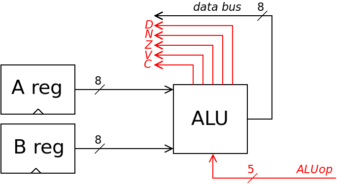

# Overview of the *CSCvon8* Design and Architecture

This is a description of the architecture of the *CSCvon8* CPU, which
is my attempt to design an 8-bit CPU with a crazy small number of 7400-style
chips.

 

The *CSCvon8* CPU, as shown above, has a von Neumann architecture with
both instructions and data being fetched across the 8-bit data bus into the
CPU registers.

There are two data registers, A and B which can be loaded and which
provide inputs to the ALU. The ALU's output can then be delivered
across the data bus into these data registers, stored in the RAM, or output on the UART.

Main memory is provided by a 32K ROM and a 32K RAM device. Instructions and
static data can be stored in the ROM. The RAM can store data and
instructions. This allows programs to be downloaded over the UART link.

The 16-bit address bus provides the memory access address to the ROM and ROM.
This can be provided either by the 16-bit program counter (*PC*) or from an
address register (*AR*) which is split into two 8-bit registers.

The PC normally increments but there is a jump logic device which allows
the PC to jump to a new instruction location as required.

# Microcoded Instructions

The *CSCvon8* CPU uses microcoding to perform its instructions. Each instruction
is eight bits long. This value, along with the current phase number from the
microsequencer (*uSeq*) indexes into the instruction decode device to generate
the control lines for this phase of the instruction.

Instructions are performed as a sequence of microinstructions over a number
of phases. The microsequencer increments its 4-bit phase counter on each clock
cycle until it is reset to zero. Thus, a single instruction can be composed of from one 
up to sixteen microinstructions.

On phase zero, regardless of the current contents of the IR, the PC identifies
a location in memory (RAM or ROM) and the contents of this location is fetched
and stored into the IR; the PC is also incremented. This is the "fetch" microinstruction for each
high-level instruction.

Phase one and onwards for each high-level instruction runs the relevant
"execute" microinstructions. These may, for example, load a value into
a data register, perform an ALU instruction and store the result into a
memory location.

On the last microinstruction in a sequence, the microsequencer phase is
reset back to zero, so that the next high-level instruction will be fetched
from memory on the next clock cycle.

# Data Bus Writers

Three components can write on the 8-bit data bus: the ALU, the memory devices
and the UART. Each one requires a line to control when it can output a value.
When one device is outputting a value, all other devices generate a floating
"high-Z" value.

# Data Bus Readers

There are several components which can read from the data bus: the RAM, the
UART, the two Address registers, the instruction register (*IR*) and the A & B
data registers. Although it is electrically possible to allow any or all
to do this at the same time, the CPU cannot generate enough control lines
to permit this. Instead, only one component can read from the data bus
at any time.

# Address Bus Writers

There are two devices that can write on the address bus: the PC and
the Address register. A single control line is used to select one or the other.

# Absolute and Indexed RAM Addressing

The Address register's value is loaded over the data bus. It can get its
values from RAM and the ALU. As the ALU can perform addition, this allows
for both absolute and indexed addressing.

For example, the address $2000 can be stored as two separate bytes in RAM.
Each byte can be loaded, in turn, into *ARhi* and *ARlo* to perform absolute
addressing.

To do indexed addressing, address values and offsets are loaded through the A and B registers so that addition can be done. For example, consider how to calculate the indexed address $2000,B. Firstly,
the $00 is  loaded into the A register. A+B is then be
calculated and stored into *ARlo*. Then the $20 is loaded into the A
register and incremented if there was a carry on the previous addition.
The result is then stored into *ARhi*. The effect is to calculate the indexed
address $2000,B.

# TTL Style Chips

The diagram above shows fourteen logical components in the CPU design. In
reality, each logical component is constructed from one or more physical chips.
Seventeen chips and one oscillator are needed to build this CPU. All chips
use the 0V/5V TTL levels for logic zero and one, respectively.

The following table identifies each component and the physical chips that
construct it. 

| Component | Chip(s) |
|-----------------|-----------|
| RAM | LY62256 32Kx8 SRAM | 
| ROM | 28C256 32Kx8 EEPROM | 
| UART |  UM245R |
| ALU | M27C322 2Mx16 EPROM |
| ARhi | 74HCT574 |
|ARlo | 74HCT574 |
| IR | 74HCT574 |
| A reg | 74HCT574 | 
| Breg | 74HCT574 | 
| PC | Two 74LS593 | 
| Jump Logic | 74HCT151 | 
| Decode Logic | M27C1024 64Kx16 EEPROM | 
| Microsequencer | 74HCT161 |
| Other chips | 74HCT138, 74HTC139 |

A 74HCT138 3:8 demux and a 74HCT139 2:4 demux are needed for some decode logic.

## The ALU and Its Operations

The ALU is built using a 2Mx16 M27C322 EPROM. The two 8-bit inputs are input to
the ALU as shown in the following diagram. The 5-bit ALUop control lines select the ALU operation.

 

The contents of the ALU ROM essentially defines what calculations the CPU
can perform. Below is the current list of ALU operations.

|0-7 ALU Ops|8-15 ALU Ops |16-23 ALU Ops|24-31 ALU Ops|
|----------------|-------------------|--------------------|--------------------|
|       0           |   B-1               |     A*B (high bits) | A ROR B    |
|       A        |      A+B               |     A*B (low bits) | A AND B    |
|       B          |    A+B+1     |     A/B                | A OR B        |
|       -A          |   A-B               |     A%B        | A XOR B       |
|       -B          | A-B (special) |   A &lt;&lt; B  | NOT A      |
|       A+1         |   B-A               | A &gt;&gt; B arithmetic | NOT B |
|       B+1         |   A-B-1     | A &gt;&gt; B logical | A+B (BCD) |
|       A-1         |   B-A-1     | A ROL B        | A-B (BCD) |


To do 16-bit and higher addition and subtraction, you can load the low 8 bits of the inputs into A and B and do A+B. If there is a carry, then on the following instructions you load the next highest 8 bits of the inputs into A and B and do A+B+1.

### Conditional Operations

The *CSCvon8* CPU, unlike its [CSCv2 predecessor](https://minnie.tuhs.org/Programs/CrazySmallCPU/), does not have a Flags
register. However, the CPU still needs the ability to change the flow of
instruction execution based on data comparisons.

This is done by the ALU outputting both an 8-bit result and five flag values:
a (D)ivide by zero, a negative result (N), an overflow (V), a carry (C)
and/or a zero result (Z).

The D, N, Z, V and C bits are sent to the Jump logic along with two
UART status lines: UART is ready to send a character, UART has a character
ready to be received. The Jump logic is a 74HCT151 8:1 multiplexer.
This is controlled by  three *Jumpsel* bits using this table:

| Jumpsel | PCjump (active low) is set to |
|-------------|-----------------------|
|     0       |  No jump |
|    1      |    C, i.e. jump if carry |
|    2     |    V, i.e. jump if overflow |
|   3     |     Z, i.e jump if negative |
|   4     |     N, i.e jump if negative |
|   5     |     D, i.e jump if divide by zero |
|   6     |     Jump if not ready to transmit |
|   7     |     Jump if not ready to receive |

The CPU can thus conditionally jump based on the flags calculated on the ALU's result. The ALU also provides several operations (see above) to assist with the types of
conditional jumps that a CPU is expected to provide:

| ALU operation | Jumpsel | Action peformed |
|--------------------|-------------|-----------------------|
| 0                     |    3 (Z)   |   Always jump   |
| A - B                 |    3 (Z)   |  Jump if A == B |
| A - B (special) |    3 (Z)   |  Jump if A != B |
| B - A         |   1 (C)       | Jump if A > B |
| A - B         |   1 (C)       | Jump if B > A |
| B - A - 1             |   1 (C)       | Jump if A >= B |
| A - B - 1             |   1 (C)       | Jump if B >= A |


The special "A - B" ALU operation still produces the result of A - B, but the Zero flag is inverted to allow the not equals comparison.

## Microcoded Instructions

The Decode Logic ROM outputs 16 bits of control lines for each
microinstruction. The lowest 5 bits are the ALU operation (0x00 to 0x1F)
described previously. Above that, the lines are mnemonically known as:

```
	# Loads from the data bus
	IRload     = 0020
	Aload      = 0040
	Bload      = 0060
	MEMload    = 0080
	AHload     = 00A0
	ALload     = 00C0
	IOload     = 00E0
	
	# Writers on the data bus
	MEMresult  = 0000
	ALUresult  = 0100
	UARTresult = 0200
	
	# Jump operations
	NoJump      = 0000
	JumpCarry   = 0400
	JumpOflow   = 0800
	JumpZero    = 0C00
	JumpNeg     = 1000
	JumpDivZero = 1400
	JumpNoTx    = 1800
	JumpNoRx    = 1C00
	
	# Address bus writers: if no ARena then
	# the PC is writing on the address bus
	ARena#     = 2000	(active low)
	
	# Other control lines
	PCincr    = 4000	(active high)
	uSreset#  = 8000	(active low)
```
	
A high-level instruction is encoded as one instruction byte followed by zero or more bytes. For example, the instruction to increment B is one byte long.

An instruction to load an 8-bit constant into a register is two bytes long: the instruction followed by the constant.

An instruction to reference a memory location is three bytes long: the instruction followed by the 16-bit address stored in two high-endian bytes.

Each high-level instruction is encoded as one or more microinstructions in a microsequence.
Every microsequence starts with the following microinstruction to load the IR from memory and increment the PC:

```
    START := MEMresult IRload PCincr
```
    
Some microsequences are quite short. For example, here is the sequence to load A with a constant:

```
	# Load A with constant $XX
	60 LCA: MEMresult Aload PCincr
	        uSreset
```

The 60 is instruction byte 0x60 with menmonic *LCA*.
Other microsequences are longer, for example:

```
	# Store A at absolute location $HHLL
	41 STO_A: MEMresult AHload PCincr
        	  MEMresult ALload PCincr
        	  ALUresult A ARena MEMload
        	  uSreset
```
	        
ALU operations that store results in the A and B registers are quite short:

```
	01 LDA_0:       ALUresult 0 Aload
                	uSreset
	02 LDA_B:       ALUresult B Aload
                	uSreset
	03 LDA_-A:      ALUresult -A Aload
                	uSreset
	04 LDA_-B:      ALUresult -B Aload
                	uSreset
	05 LDA_A+1:     ALUresult A+1 Aload
                	uSreset
```

	
Here is an example of an indexed instruction to load A from the $HH00,B location:

```
	90 LDA_,B: MEMresult AHload PCincr
        	   ALUresult B ALload ARena
        	   ARena MEMresult Aload
        	   uSreset
```

In terms of design, microcoding gives you more flexibility with the design of the instruction set architecture, but this comes at a cost of a large ROM to store the microcode.
