# Building the CSCvon8 on a PCB

If you're reading this document, you are probably interested in building
the CSCvon8 CPU on a PCB. Either you have obtained a spare PCB from Warren,
or you have ordered your own PCB from the Kicad PCB layout.

## PCB Versions

One thing that you should be aware of is that there are two versions of the
PCB: the "2019/05/08" version and the "2019/06/07" version.

If you have the "2019/06/07" version of the PCB, then the UM245R UART is
oriented so that the USB connect points upwards to the edge of the PCB.
Here's what this version of the PCB should look like when fully populated:

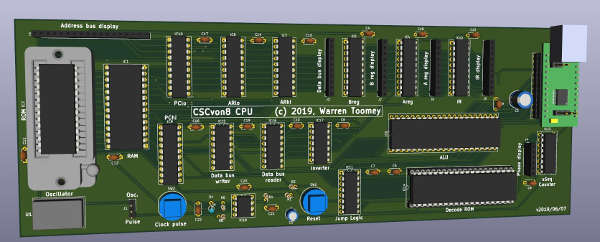

If you have the "2019/05/08" version of the PCB, then the UM245R UART is
oriented so that the USB connect points downwards towards the IC13
microsequencer chip. Also, you need to disconnect pin 7 of the IC11
74HCT151 Jump Logic chip and run a wire from this pin to pin 4 of the 
IC16 74HCT138 chip. This pin was originally wired to ground, but it
should be wired to the system clock signal. Here are a couple of pictures
of the added wire:

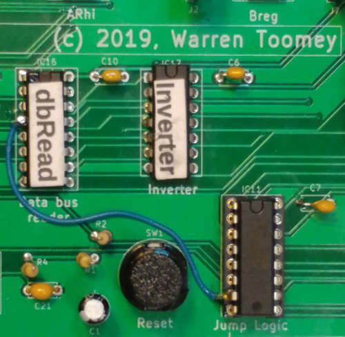 &nbsp;&nbsp; 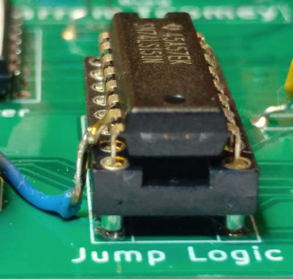

And here is a picture of the PCB before the need for the wire was
discovered:

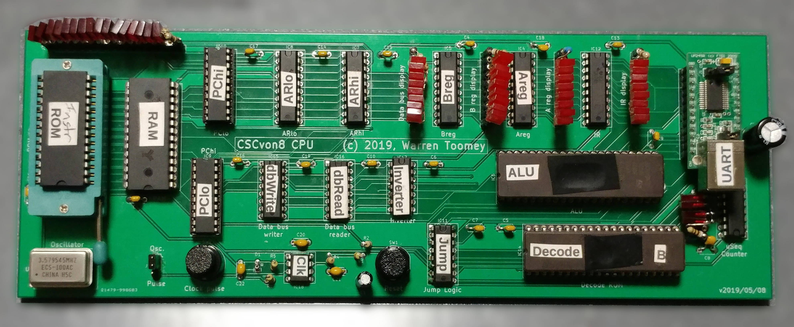

## Bill of Materials

You can find the [bill of materials here](bom_20190601.csv).
I ordered most of my components from Digikey. Some things I could not
easily obtain from them or other places, e.g. the 74LS593 registers
and the large EPROMs. For these, I searched on
[utsource](https://www.utsource.net/).

## Special Tools Required

Apart from the usual tools (soldering station, side cutters, pliers etc.),
you will also need these specialised tools and equipment:

 + An EPROM burner. I bought a Minipro EPROM programmer from eBay.
   Search for "minipro programmer". My model is a TL866CS.
 + The Minipro programmer can only accomodate DIP chips up to 40 pins.
   To burn the 42-pin M27C322 EPROM for the ALU, you will need an adaptor. I
   bought mine from
   [Digicoolthings](http://digicoolthings.com/eprom-programmer-adapter-for-27c400800160-and-27c322-16bit-eproms/).
   They are also available on eBay; search for "TL866 Programmer Adapter for
   27C322".
 + A UV eraser so that you can erase the ALU and Decode EPROMs. Again, eBay.
   Search for "UV EPROM eraser".

## Step 1: Clock Pulse and Reset

The first step is to solder in the 555, the switches and the associated
diode, capacitors and resistors:

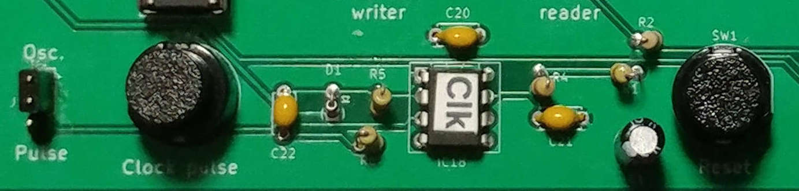

Also solder in a 24-pin DIP socket for the UM245R, as this is going to provide
the 5V supply to the whole board. You could solder the UM245R onto the PCB;
I chose not to as it is expensive. Make sure that the jumpers on the UM245R
are set as per the photo below so that it is passing on the 5V from the USB
input:

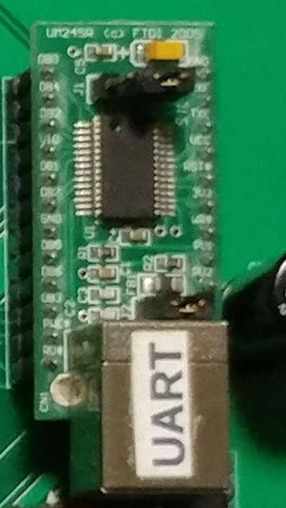

Also, solder in the C3 220uF capacitor which will help to smooth out any
DC spikes.

With the clock pulse, reset components and the UM245R installed, you should
be able to power up the board. Check that you see a clock pulse on the
Pulse pin of the 3-pin Osc./Pulse pin header. Put a jumper in to wire
the Pulse pin to the middle pin.

## Step 2: The Microsequencer

Next up, solder in the IC13 74HCT161 microsequencer just below the UART and
its bypass capacitor. If you want to display the microsequencer's value on
LEDs, also solder in the pin socket next to the chip:

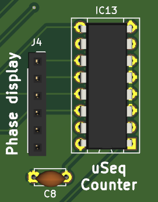

I created several LED arrays with some pin sockets, some rectangular LEDs
and a few 1K (or close) resistors, e.g.:

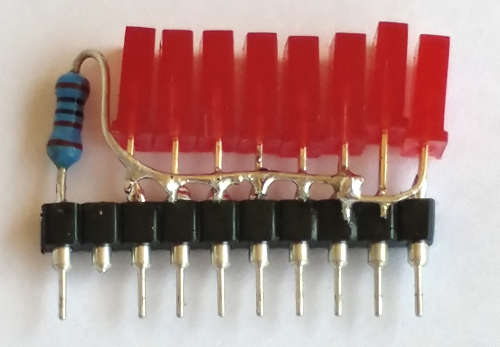

On my board, the "2019/05/08" version, the UART sits right above the LED
display for the 74HCT161 microsequencer, so I had to solder the LEDs and
resistor directly to the board.

Make sure, when mounting your LED array, to orient it with the ground pin
in the right location.

To test the 74HCT161 microsequencer, first get a breadboard patch cable
and wire pin 3 of the IC14 Decode ROM high. This sets *uSreset#* high
and allows the microsequencer to count. Power on the board. As you press
the Clock pulse button, you should see the microsequencer count up. You
can also press the Reset button and the microsequencer value should return
to zero.

## Step 3: The Databus Writer Demux

The next step is to solder in the IC15 74HCT139 demultiplexer and its
bypass capacitor. Half of this chip is used as an inverter gate to convert
the system clock signal into an inverted *Clkbar#* signal.

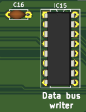

Power up the board, toggle the Clock pulse button. You should observe pin 11
of IC15 drop: *Clkbar#* is normally high but goes to zero when the clock
pulse is high.

## Step 4: Hardware for the First Instructions

This is going to be a big step. The aim here is to actually load an
instruction into the Instruction Register, and generate the control lines
for each microinstruction. The sort of code you should be able to do is:

```
        NOP
        NOP
        OUT 'H'
        OUT 'e'
        OUT 'l'
        OUT 'l'
        OUT 'o'
```

For these instructions to work, you need:

 + an Instruction ROM with the machine code of these instructions
 + a Program Counter to generate the address for each instruction
 + an Instruction Register to load the NOP and OUT instructions
 + the Decode ROM so that it can generate most of the control lines
 + the 74HCT138 databus reader demultiplexer, as it generates the *IRload* line
 + the 74HCT04 inverter as it inverts *IRload* to create *IRload#*
 + the 74HCT151 8:1 multiplexer, as this will stop the PC from jumping
   and ensure that it increments instead

So the steps are:

 + Solder in the IC2 DIP-28 socket and associated capacitor. Make sure
   that you don't use one with circular pin holes: if you choose to use a
   ZIF socket, they have rectangular pins. Try the left-hand sockets below:

   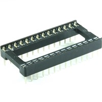 &nbsp;&nbsp; 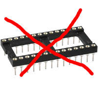

 + Solder in the IC9 and IC10 74LS593 Program Counter chips and
   associated capacitors.
 + Solder in the IC12 74HCT574 Instruction Register and associated capacitor.
   Also solder in the pin socket for the IR LED array.
 + Solder in the IC14 DIP-40 socket associated capacitor. I'm not sure if
   I was able to get this socket, so I just used two long pin sockets and
   cut them to 20 pins each. This is for the Decode ROM. Yes, if you do
   want to change the set of instructions in the CSCvon8 CPU, you will need
   to move this in & out. This should not happen very often, so you won't
   need a ZIF socket here.
 + Solder in the IC16 74HCT138 3:8 demultiplexer and associated capacitor.
 + Solder in the IC17 74HCT04 inverter and associated capacitor.
 + Solder in the IC11 74HCT151 8:1 multiplexer and associated capacitor.
   Also remember to leave pin 7 out and wire it to pin 4 of IC16, if you have
   the "2019/05/08" version of the PCB.

 + I would also recommend installing the pin socket to display the data bus
   value, and build a LED array for the IR and another LED array for the
   data bus. Ditto, solder in the pin socket for the address bus, and build
   a 16-LED array for the address bus. I chose to use four resistors here for
   groups of four LEDs.

Yes, this is a lot of work!

I've highlighted below the components you should add in this step:

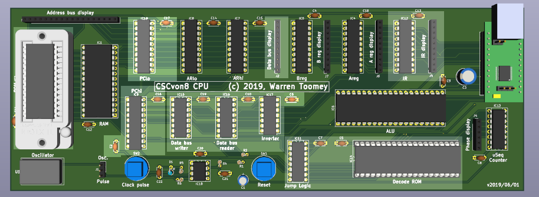

## Step 5: Running Your First Instructions

Now, on to the testing of the board. For this, you are going to need:

  + the Decode ROM with the microinstructions burned into it
  + the Instruction ROM with the assembled instructions burned into it

If you haven't already, use a UV eraser to erase the contents of your
AT27C1024 EPROM. I let my eraser go for 10 minutes, but yours may require
a different length of time.

Go back to your [downloaded Github repository](https://github.com/DoctorWkt/CSCvon8)
for the CSCvon8. Run the *gen_ucode* script to generate the *27Cucode.rom*
file. This has to be written to your AT27C1024 EPROM. Here is my Linux
shell script that runs the
[minipro software](https://gitlab.com/DavidGriffith/minipro/):

```
#!/bin/sh
if [ ! -f "../27Cucode.rom" ]
then echo ../27Cucode.rom does not exist; exit 1
fi
minipro -p 'M27C1024 @DIP40' -y -w ../27Cucode.rom
```

I have a *ROMs/* folder below the main Github repository where I keep
the scripts for writing the ROMs. Once you have successfully burned the
AT27C1024 EPROM, gently insert it into the IC14 DIP40 socket. I get the
pins on one side just in their row. Then I use a small flat-egde screwdriver
on the other side to reorient the wayward pins on my side and get them to
go into their pin holes. Just be gentle but firm when you push the ROM
in: you don't want to bend or break any pins!

Back in the main Github repository, assemble your program with the *cas*
assembler to create the file *instr.rom*. You can run the *disasm*
script to disassemble the output. Run it with *less* and you should see:

```
0000: 00 NOP 
0001: 00 NOP 
0002: 68 OUT $48
0004: 68 OUT $65
0006: 68 OUT $6c
0008: 68 OUT $6c
000a: 68 OUT $6f
```

Now run a Linux script like this to burn this to an AS6C62256 32K EEPROM:

```
#!/bin/sh
hex2bin ../instr.rom fred.bin
minipro -p 28C256 -w fred.bin
rm fred.bin
```

I have a separate script, *hex2bin*, that converts the hex output from the
assembler into binary. Here it is:

```
#!/usr/bin/perl
use strict;
use warnings;
use autodie;

die("Usage: $0 hexfile binfile\n") if (@ARGV != 2);

open(my $IN, '<', $ARGV[0]);
open(my $OUT, '>:raw', $ARGV[1]);

while (<$IN>) {
  chomp;
  foreach my $hexbyte(split(m{\s+}, $_)) {
    print($OUT pack("C1", hex($hexbyte)));
  }
}

close($IN); close($OUT);
exit(0);
```

Take your burned AS6C62256 EEPROM out and insert it into the IC2 ZIF socket.
**Important!** Make sure that chip is upside down with pin 1 at the bottom.

Plug your USB cable into the UM245R, and start a terminal program
like [minicom](https://en.wikipedia.org/wiki/Minicom) on your computer.

Hit the Reset button to reset the microsequencer to zero. Then start
generating clock pulses with the Clock pulse button. You should see
the microsequencer go to 1 and then back to zero. The NOP is done.
The next time the microsequencer goes to 1, the IR should have loaded
the value 0x68 which is the OUT instruction. On microsequence 2, the
character is loaded out of the ROM onto the data bus, and the UART is
told to transmit it. You should see a letter appear on your *minicom*
display. Keep pulsing the clock to see the other characters. Once the
instructions are all done, the rest of the Instruction ROM is full of
NOP instructions so no more activity will occur if you keep pulsing the
clock signal.

## Step 6: The A and B registers

The next step is to solder in the IC4 74HCT574 and IC5 74HCT574 A and B
registers, and associated capacitors. Also solder in the pin sockets
for the two registers, and build two LED arrays to display the A and B
values.

To test the resgisters, you should be able to assemble a program like
this one:

```
        LCA $01
        LCB $02
        LCA $03
        LCB $04
        LCA $05
        LCB $06
```

We can't yet print out the registers, as we need the ALU. This is going to
be the next step.

## Step 7: The ALU

The ALU is IC6, a 42-pin M27C322 EPROM. It's the biggest component on the
PCB. I'd highly recommend that you use an IC socket instead of soldering
it to the board. This is in case you ever need to change the ALU operations.
So far, I haven't needed to do this. Don't forget the bypass capacitor
associated with IC6.

To generate the ALU ROM's contents, run the *gen_alu* script in your copy
of the Github repository. Make sure that you have created a *ROMs/* folder
in your copy of the repository, as the *gen_alu* script will create eight
segments of the ALU ROM's contents in this subfolder.
While you are doing this, erase your M27C322 EPROM with your UV eraser.

The M27C322 EPROM is too big to fit into the Minipro programmer. You will
need to use the TL866 adapter. Remember to set the switch to "M27C322".
Here is the script that I used to burn the eight segments of the ALU ROM
image to the ROM.

```
#!/bin/sh
# Write each segment of the ALU data out to the ROM
for i in 0 1 2 3 4 5 6 7
do echo -n "Put TL866 Adaptor rotary switch in position $i, hit Enter: "
   read fred
   minipro -p 'AT27C4096 @DIP40' -y -w alu$i.rom
done
```

Make sure you really do start with the rotary switch at position zero!
My switch wasn't well marked, and so for a while I was starting at
position five.
Once the ALU ROM is burned, gently insert it into the IC socket on the PCB.

With this done, you can assemble programs that perform ALU operations,
and also pass A and B register values through to the data bus where they
can be printed by the UART. An example program might be:

```
        LCA 'H'
        OUT A           # Print out a 'H'
        LCB 'i'
        OUT B           # Print out an 'i'
        LCA $20
        LCB $01         # Add $20+$01 to get $21
        LDA A+B
        OUT A           # which is a '!' character
```

## Step 7: The Address Register Chips

We are two steps away from finishing the CPU. In this step, solder in IC7
and IC8 74HCT574 registers and associated capacitors. These form the 16-bit
Address Register. With these and the ALU installed, you can now perform
the jump instructions in the instruction set.

Some of the example programs you can try here are:

 + [example01.s](../Examples/example01.s)
 + [example02.s](../Examples/example02.s)
 + [example04.s](../Examples/example04.s)
 + [example08.s](../Examples/example08.s)

## Step 8: The RAM

The final hardware component, unless I missed something, is the IC1 AS6C62256
32K RAM chip. It's the same size as the Instruction ROM. It's up to you if
you want to solder it in, or use an IC socket. I used a socket here.

At this point, you are probably getting sick of pushing the Clock pulse
button to run instructions. I built this 555 circuit which has the same pins
as the 1MHz and 3.57MHz oscillators that I bought.

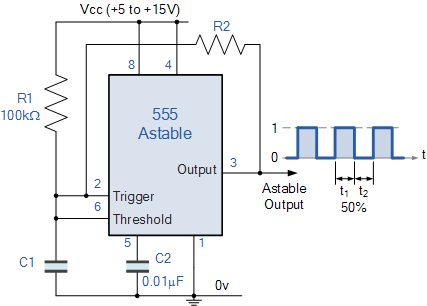


The design for this 50% duty cycle circuit comes from 
[this web page](https://www.electronics-tutorials.ws/waveforms/555_oscillator.html).

Here is the layout of the small stripboard that I used to
build the circuit. I used four individual pin sockets as the legs.
On top, I used another two pin sockets so that I could change the
C1 timing capacitor and thus have a wide set of running frequencies.

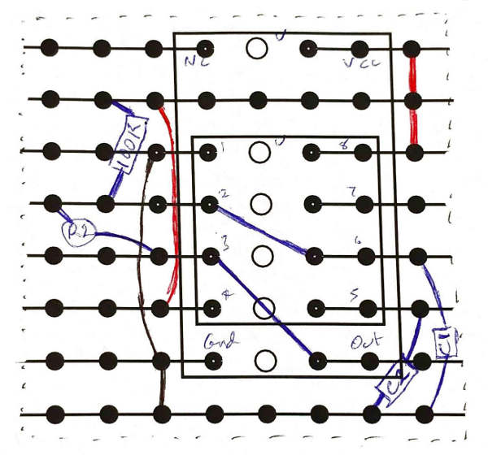

Below are photos of the stripboard from top, below and the side.

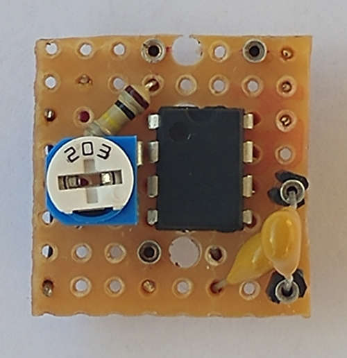 &nbsp; &nbsp; 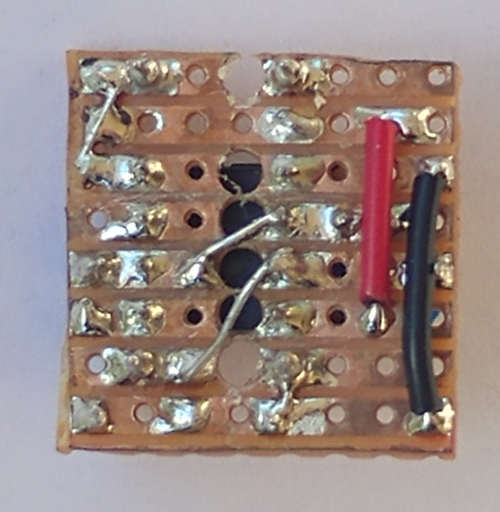 &nbsp; &nbsp; 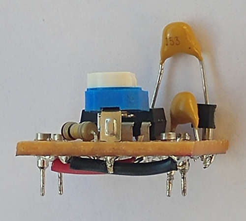

I'd recommend that you solder in a 4-pin DIP18 IC socket so that you can
insert and remove the 555 clock circuit, but also replace it with a faster
oscillator.

At this point, the PCB is complete. Now you can try assembling, burning
and running any of the *exampleNN.s* programs in the *Examples/* folder.

## Step 9: Higher Clock Speeds

Based on my calculations, the CPU should be able run at clock speeds up
to around 2.5MHz. However, my PCB can mostly run at 3.57MHz. It definitely
should be stable at 1MHz. So now go and get some 4-pin oscillators that
will fit in the 4-pin DIP18 IC socket, and see what clock speeds your PCB
can reach.

## Step 10: Burning the Monitor ROM

By now you are probably getting sick of burning the Instruction ROM each
time you want to change the program. Now you might want to burn the
[monitor.s](../Examples/monitor.s) program to ROM. This is a very
rudimentary system monitor. With it, you can *Dump* memory location values,
*Change* memory location values, and *Run* machine code starting at a
specific location. Example commands are:

 + D8000: Dump 16 bytes starting at 0x8000
 + D: Dump 16 bytes at the location after the previous dump
 + C8000: Change memory starting at location 0x8000. Enter hex pairs
   separated by spaces, and end with a Z.
 + R8000: Run a program that has been entered and which starts at 
   location 0x8000.

The *cas* assembler can generate output for loading in the RAM with the
monitor. Here's an example:

```
$ ./cas -r Examples/wktlife.s
```

generates code for running in RAM as the file *Examples/wktlife.hex*,
which looks like this:

```
C8000
60 ce 61 00 94 ce 26 7c 80 0d 70 80 04 05 41 80 
05 61 f1 72 80 02 60 01 41 e0 40 41 e0 41 41 e1 
3f 41 e1 40 41 e2 40 77 80 27 68 1b 77 80 2c 68 
5b 77 80 31 68 32 77 80 36 68 4a 60 01 41 f0 08 
60 d2 41 f0 07 61 00 60 80 94 ce 94 cf 26 72 80 
49 60 d1 41 80 c1 60 d2 41 80 86 77 80 5b 68 1b 
77 80 60 68 5b 77 80 65 68 48 60 00 41 f0 01 41 
f0 02 41 f0 06 63 f0 08 26 90 ce 41 f0 04 90 cf 
41 f0 03 92 ce 90 d2 41 f0 05 92 cf 63 f0 03 09 
63 f0 04 49 f0 00 62 f0 01 63 f0 02 09 63 f0 00 
09 61 01 76 80 b6 61 04 75 80 b6 61 03 71 80 bb 
62 f0 06 70 80 bd 60 00 70 80 bd 60 01 63 f0 08 
92 d1 61 01 71 80 cf 77 80 c7 68 2e 70 80 d4 77 
80 cf 68 40 63 f0 08 46 f0 08 60 80 71 80 f7 62 
f0 02 63 f0 06 49 f0 01 62 f0 00 63 f0 03 4b f0 
02 42 f0 06 70 80 75 77 80 f7 68 0a 63 f0 07 60 
f0 71 81 1b 46 f0 07 62 80 86 41 80 c1 62 f0 07 
41 80 86 60 01 41 f0 08 70 80 6a 61 00 60 80 77 
81 1f 68 2e 26 72 81 1f 77 81 28 68 0a 71 80 3b 
Z
```

When you are in *minicom* and you have the monitor prompt, you can
use *ctrl-A Y* to paste a file to the monitor. Choose *Examples/wktlife.hex*.
The above *C8000* and hex stream will be uploaded to the monitor. Then
you can *R8000* to run the program. You can see this program running in
[this YouTube video](https://www.youtube.com/watch?v=LJe3Z_fGDhg).

## What Next?

From here on, it's now mostly a software game. Look at the *microcode*
and the *opcodes* to see what instructions are available. Read through and
try some of the example programs. Use the *clc* compiler to compile the
high-level programs and then assemble them.

Remember that, if you try to run things in RAM, don't use memory locations
where the code will end up. You may have to modify the example programs
to *not* use locations at or near 0x8000, as that's where *cas -r* places
the code.

You can also try writing the microcode for your own instructions, but you
will need to erase, burn and reinsert the Decode ROM chip. If you are
really keen, you can try out some new ALU operations, but you'll need to
modify the name of the ALU operations in the microcode file. And you'll
have to erase, burn and reinsert the ALU ROM chip. At least you can try
these out with the *csim* simulator and the Verilog version of the CPU
before you replace the ROMs on the PCB.
