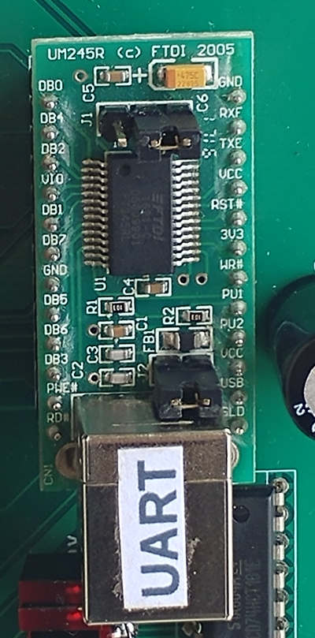

# Building the CSCvon8 on a PCB

If you're reading this document, you are probably interested in building
the CSCvon8 CPU on a PCB. Either you have obtained a spare PCB from Warren,
or you have ordered your own PCB from the Kicad PCB layout.

## PCB Versions

One thing that you should be aware of is that there are two versions of the
PCB. If you have the PCB with the "2019/05/08" version number at the
bottom-right, then you will need to mount the UM245R UART with the USB
connector pointing downwards. And on the underside of the PCB, you will
need to wire a 330pF capacitor from pin 6 of the 74HCT251 Jump Logic chip
to Vcc. This helps to prevent a glitch with the Jump instructions. The
completed "2019/05/08" PCB looks like this:


If you have the "2019/06/01" version of the PCB, then the UM245R is
oriented so that the USB connect points upwards to the edge of the PCB.
Also, there is a 330pF capacitor, C2, right next to the PClo 74LS593
chip, as show in these pictures.


## Bill of Materials

You can find the [bill of materials here](bom_20190601.csv).

## Step 1: Clock Pulse and Reset

The first step is to solder in the 555, the switches and the associated
diode, capacitors and resistors:


Also solder in a 24-pin DIP socket for the UM245R, as this is going to provide
the 5V supply to the whole board. You could solder the UM245R onto the PCB;
I chose not to as it is expensive. Make sure that the jumpers on the UM245R
are set as per the photo below so that it is passing on the 5V from the USB
input:



Also, solder in the C3 220uF capacitor which will help to smooth out any
DC spikes.

With the clock pulse, reset components and the UM245R installed, you should
be able to power up the board. Check that you see a clock pulse on the
Pulse pin of the 3-pin Osc./Pulse pin header. Put a jumper in to wire
the Pulse pin to the middle pin.

## Step 2: The Microsequencer

Next up, solder in the IC13 74HCT161 microsequencer just below the UART and
its bypass capacitor. If you want to display the microsequencer's value on
LEDs, also solder in the pin socket next to the chip:


I created several LED arrays with some pin sockets, some rectangular LEDs
and a few 1K (or close) resistors, e.g.:


On my board, the "2019/05/08" version, the UART sits right above the LED
display for the 74HCT161 microsequencer, so I had to solder the LEDs and
resistor directly to the board.

Make sure, when mounting your LED array, to orient it with the ground pin
in the right location.

To test the 74HCT161 microsequencer, first get a breadboard patch cable
and wire pin 3 of the IC14 Decode ROM high. This sets *uSreset#* high
and allows the microsequencer to count. Power on the board. As you press
the Clock pulse button, you should see the microsequencer count up. You
can also press the Reset button and the microsequencer value should return
to zero.

## Step 3: The Databus Writer Demux

The next step is to solder in the IC15 74HCT139 demultiplexer and its
bypass capacitor. Half of this chip is used as an inverter gate to convert
the system clock signal into an inverted *Clkbar#* signal.


Power up the board, toggle the Clock pulse button. You should observe pin 11
of IC15 drop: *Clkbar#* is normally high but goes to zero when the clock
pulse is high.

## Step 4: Hardware for the First Instructions

This is going to be a big step. The aim here is to actually load an
instruction into the Instruction Register, and generate the control lines
for each microinstruction. The sort of code you should be able to do is:

```
	NOP
	NOP
	OUT 'H'
	OUT 'e'
	OUT 'l'
	OUT 'l'
	OUT 'o'
```

For these instructions to work, you need:

 + an Instruction ROM with the machine code of these instructions
 + a Program Counter to generate the address for each instruction
 + an Instruction Register to load the NOP and OUT instructions
 + the Decode ROM so that it can generate most of the control lines
 + the databus reader demultiplexer, as it generates the *IRload* line
 + the 74HCT04 inverter as it inverts *IRload* to create *IRload#*
 + the 74HCT251 8:1 multiplexer, as this will stop the PC from jumping
   and ensure that it increments instead

So the steps are:

 + Solder in the IC2 DIP-28 socket and associated capacitor. Make sure
   that you don't use one with circular pin holes: if you choose to use a
   ZIF socket, they have rectangular pins. Try the left-hand sockets below:

    &nbsp;&nbsp; 

 + Solder in the IC9 and IC10 74LS593 Program Counter chips and
   associated capacitors.
 + Solder in the IC12 74HCT574 Instruction Register and associated capacitor.
   Also solder in the pin socket for the IR LED array.
 + Solder in the IC14 DIP-40 socket associated capacitor. I'm not sure if
   I was able to get this socket, so I just used two long pin sockets and
   cut them to 20 pins each. This is for the Decode ROM. Yes, if you do
   want to change the set of instructions in the CSCvon8 CPU, you will need
   to move this in & out. This should not happen very often, so you won't
   need a ZIF socket here.
 + Solder in the IC16 74HCT138 3:8 demultiplexer and associated capacitor.
 + Solder in the IC17 74HCT04 inverter and associated capacitor.
 + Solder in the IC11 74HCT251 8:1 multiplexer and associated capacitor.
   Also remember to solder in the C2 330pF capacitor, either next to IC11
   or underneath the board from pin 6 of IC11 to ping 16 of IC11.
 + I would also recommend installing the pin socket to display the data bus
   value, and build a LED array for the IR and another LED array for the
   data bus.

Yes, this is a lot of work!

I've highlighted below the components you should add in this step:


## Step 5: Running Your First Instructions

Now, on to the testing of the board. For this, you are going to need:

  + the Decode ROM with the microinstructions burned into it
  + the Instruction ROM with the assembled instructions burned into it

If you haven't already, use a UV eraser to erase the contents of your
AT27C1024 EPROM. I let my eraser go for 10 minutes, but yours may require
a different length of time.

Go back to your [downloaded Github repository](https://github.com/DoctorWkt/CSCvon8)
for the CSCvon8. Run the *gen_ucode* script to generate the *27Cucode.rom*
file. This has to be written to your AT27C1024 EPROM. Here is my Linux
shell script that runs the
[minipro software](https://gitlab.com/DavidGriffith/minipro/):

```
#!/bin/sh
if [ ! -f "../27Cucode.rom" ]
then echo ../27Cucode.rom does not exist; exit 1
fi
minipro -p 'M27C1024 @DIP40' -y -w ../27Cucode.rom
```

I have a *ROMs/* folder below the main Github repository where I keep
the scripts for writing the ROMs. Once you have successfully burned the
AT27C1024 EPROM, gently insert it into the IC14 DIP40 socket. I get the
pins on one side just in their row. Then I use a small flat-egde screwdriver
on the other side to reorient the wayward pins on my side and get them to
go into their pin holes. Just be gentle but firm when you push the ROM
in: you don't want to bend or break any pins!

Back in the main Github repository, assemble your program with the *cas*
assembler to create the file *instr.rom*. You can run the *disasm*
script to disassemble the output. Run it with *less* and you should see:

```
0000: 00 NOP 
0001: 00 NOP 
0002: 68 OUT $48
0004: 68 OUT $65
0006: 68 OUT $6c
0008: 68 OUT $6c
000a: 68 OUT $6f
```

Now run a Linux script like this to burn this to an AS6C62256 32K EEPROM:

```
#!/bin/sh
hex2bin ../instr.rom fred.bin
minipro -p 28C256 -w fred.bin
rm fred.bin
```

I have a separate script, *hex2bin*, that converts the hex output from the
assembler into binary. Here it is:

```
#!/usr/bin/perl
use strict;
use warnings;
use autodie;

die("Usage: $0 hexfile binfile\n") if (@ARGV != 2);

open(my $IN, '<', $ARGV[0]);
open(my $OUT, '>:raw', $ARGV[1]);

while (<$IN>) {
  chomp;
  foreach my $hexbyte(split(m{\s+}, $_)) {
    print($OUT pack("C1", hex($hexbyte)));
  }
}

close($IN); close($OUT);
exit(0);
```

Take your burned AS6C62256 EEPROM out and insert it into the IC2 ZIF socket.
**Important!** Make sure that chip is upside down with pin 1 at the bottom.

Plug your USB cable into the UM245R, and start a terminal program
like [minicom](https://en.wikipedia.org/wiki/Minicom) on your computer.

Hit the Reset button to reset the microsequencer to zero. Then start
generating clock pulses with the Clock pulse button. You should see
the microsequencer go to 1 and then back to zero. The NOP is done.
The next time the microsequencer goes to 1, the IR should have loaded
the value 0x68 which is the OUT instruction. On microsequence 2, the
character is loaded out of the ROM onto the data bus, and the UART is
told to transmit it. You should see a letter appear on your *minicom*
display. Keep pulsing the clock to see the other characters. Once the
instructions are all done, the rest of the Instruction ROM is full of
NOP instructions so no more activity will occur if you keep pulsing the
clock signal.
