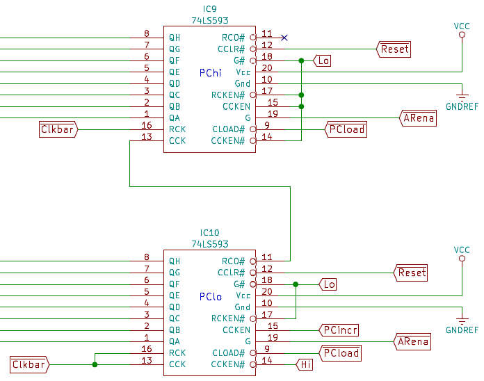

# Implementation Notes for the CSCvon8 CPU

The CVCvon8 design has been implemented in three ways. One is the Perl
simulator, *csim*. The second is the Verilog implementation. The third
is the PCB layout using physical chips. This document covers the last two.

## Verilog Implementation of the CSCvon8 CPU

I built the TTL-modelled version of the CSCvon8 CPU because I was seeing
events with the real chips when I was building my breadboard version of
the CPU, and I realised that they were being caused by the different
propagation delays through the various components.

I decided to try and model these delays in Verilog, and luckily I came across
[this set of 7400 chips modelled in Verilog](https://github.com/TimRudy/ice-chips-verilog)
by Tim Rudy. They had rise and fall delay parameters set by default to zero.
I had to build a few 7400 chip models along the way.

I've browsed the datasheets for the chips that I'm using, and here are the
propagation delays that I've set in this design.

| Component(s) | Chip| Propagation Delay |
|--------------|:---:|:-----------------:|
| Databus reader demux | 74HCT138 |  21nS  |
| Databus writer demux | 74HCT139 |  25nS  |
| Microsequencer       | 74HCT161 |  22nS  |
| Jump logic           | 74HCT151 |  20nS  |
| Several registers    | 74HCT574 |  30nS  |
| Program counter      | 74LS593  |  30nS  |
| RAM memory           | AS6C62256 |  55nS  |
| ALU ROM	       | M27C322  |  45nS  |
| Decode ROM	       | AT27C1024 |  45nS  |
| Instruction ROM      | 28C256   |  150nS  |

These delays cause a whole bunch of complications to the design of the CPU.
Here are just a few examples of the complications caused by the delays and
by the design choices that I've made.

Firstly, all of the control lines get generated
by the Decode ROM with a delay of 45nS after the microsequencer and/or IR
changes its value. Therefore, it's guaranteed that all of the control lines
will change *after* a rising edge of the system clock. Thus, it would be
impossible for the system clock to provide the rising edge signal for
those chips like the 74HCT574 and 74LS593 which load values on a rising edge:
the system clock's edge occurs well before the control lines arrive to say
what has to be done on that rising edge.

Secondly, the 28C256 instruction ROM has a significant delay between an
address change and the new data value being output by the ROM. Consider
the *LCA* instruction to load the A register from a byte in ROM immediately
following the LCA instruction byte. The microcode sequence looks a bit like:

+ load the IR from the ROM at the address supplied by the PC. Then increment the PC.
+ load the A register from the ROM at the new address supplied by the PC. Then increment the PC.

Assume that the *Aload* rising edge control line to tell A to load a value
comes out from the decode ROM delayed by 45nS compared to the system clock.
That still is too early if the address bus value has changed but it takes the
ROM 150nS to output the new value onto the data bus. By this time, the A
register will have loaded the old value on the data bus.

Finally, as mentioned, several chips require a rising edge to perform an
action. The program counter (PC), as an example, needs a rising edge *CCK*
signal to increment its value. Given that we can't use the system clock to
do this, this rising edge must be generated by the Decode ROM. But for the
ROM to do this, it has to cycle a line low, high, low etc.

Consider the microinstructions in the *LCA* instruction shown previously.
In both microinstructions, the PC has to be incremented. If the Decode ROM
generated a line called *PCincr* to do this, then it cannot be asserted in
both of these microinstructions because there would never be a low value
and at least one of the PC increments would never occur.

## Building the Physical CSCvon8 CPU

I built both the Verilog and the breadboard version of the CSCvon8 CPU
in parallel. This allowed me to work out the effects of the propagation
delays and the rising edge issue noted above.
Due to thes issues, I've had to resort to some subtle wiring in the CSCvon8.

Several components need to load the current value on the data bus: the A and
B registers, the instruction register, the address registers, RAM and the UART.
The load control lines are generated from the 3-bit LoadOp value from the
Decode ROM being demultiplexed by a 74HCT138 3:8 demux.

It would be useful to allow a component to load its value on successive
microinstructions, but if the same LoadOp value occurs on both
microinstructions then there will not be a rising edge on the load signal.

To enforce a rising edge on the load signal, the system clock is wired to the
one of the 74HCT138 active low enable lines. This causes two things to happen.

Firstly, when the system clock goes low, one load output line is asserted.
Therefore the loading is done halfway through the clock cycle when the
value on the data bus has settled, as shown below.

Secondly, when the system clock rises, the 74HCT138 is disabled. All
outputs from the 74HCT138 go high and (via the inverters) de-assert all the
load lines, also shown above.

## Rising Edges and PC Increment Delays

The program counter (PC) must be able to load its value from the address
registers on a jump, increment on consecutive microinstructions and
sometimes keep its value unchanged.

The PC load line (active low) is generated by a 74HCT151 multiplexer
and is determined by the Jump control lines and the status lines from the
ALU and UART. The PC increment line (active high) is generated from the
Decode ROM.

We need a rising edge for PC increments, and this has to be delayed until the
middle of the clock cycle due to the ROM propagation delays.

To create this rising edge in the middle of the clock cycle, an inverted
clock signal *clkbar* is generated using an inverter. This is connected
to both the *CCK* and *RCK* inputs of the 74LS593 used as the low half
of the PC. *CCK*, when enabled, increments the PC; *RCK*, when enabled,
causes the counter to load a new value.

The 74LS593 is wired so that the PC load line enables *RCK* causes the
PC load to load the value on the address bus halfway through the clock cycle.
Similarly, the PC increment line enables *CCK* so that the PC increments its
value halfway through the clock cycle.
