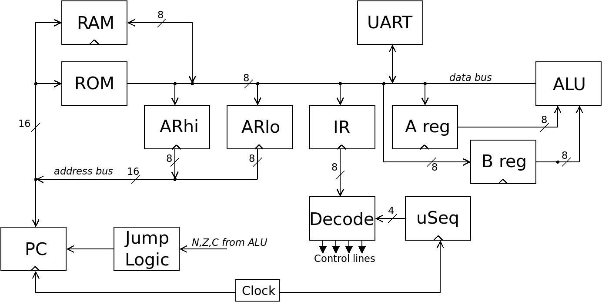

# CSCvon8: 8-bit von Neumann Crazy Small CPU

This repository holds the files for my 8-bit "big brother" CPU to the
[4-bit Crazy Small CPU](https://minnie.tuhs.org/Programs/CrazySmallCPU/).
This is a von Neumann style CPU designed with 7400-style logic chips and
some RAM and ROM. The CPU requires only sixteen chips, not including the
clock circuitry.

Right now CSCvon8 is still under development. Have a look at
[Docs/CSCvon8_design.md](Docs/CSCvon8_design.md) for the overall
design of the CPU so far. Also read the
[Docs/getgoing_instructions.md](getting started guide).

The files and folders in this repository are:
- *Docs*, documents on the design and how to use the tools below
- *Examples*, example programs for the CPU
- *Schematic*, a KiCad schematic of the CPU. Not ready for production, though
- *Verilog*, an Icarus verilog version of the CPU
- *cas*, the assembler for the CPU
- *clc*, a very crude compiler that outputs assembly that can be given to cas
- *gen_alu*, a program to generate the contents of the ALU ROM
- *journal.txt*, my running journal of the design and implementation of CSCvon8

If you want to leave any comments, feel free to use the
[GitHub issues page](https://github.com/DoctorWkt/CSCvon8/issues)
for this purpose.

Here is a diagram of the basic CSCvon8 architecture:

 
