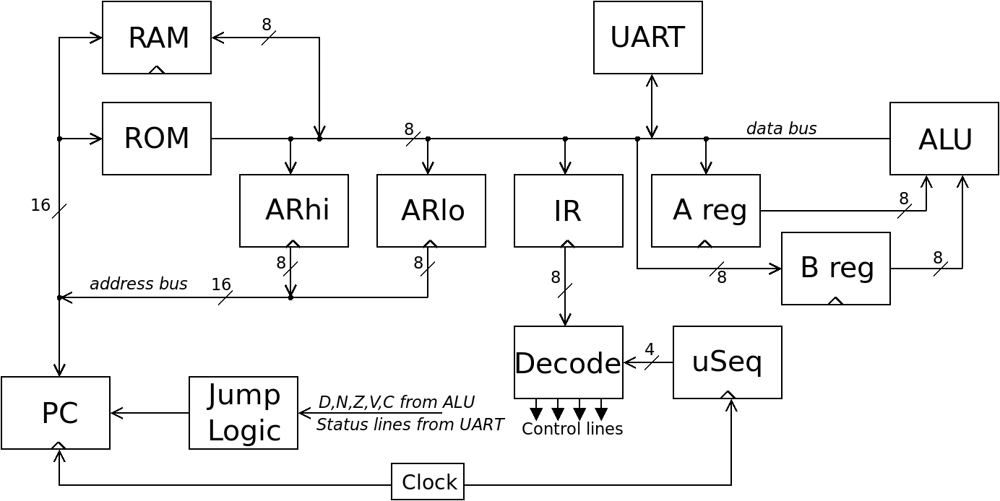

# CSCvon8: 8-bit von Neumann Crazy Small CPU

This repository holds the files for my 8-bit "big brother" CPU to the
[4-bit Crazy Small CPU](https://minnie.tuhs.org/Programs/CrazySmallCPU/).
This is a von Neumann style CPU designed with 7400-style logic chips and
some RAM and ROM. The CPU requires only seventeen chips, not including the
clock circuitry.

 

The overall design of the CPU is covered in
[Docs/CSCvon8_design.md](Docs/CSCvon8_design.md). Also read the
[getting started guide](Docs/getgoing_instructions.md).

So far I've breadboarded the CPU, and (10th May 2019) I've ordered some
PCBs to populate. Read [my journal](journal.md) for details of progress.

The files and folders in this repository are:
- *Docs*, documents on the design and how to use the tools below
- *Examples*, example programs for the CPU
- *Schematic*, a KiCad schematic of the CPU
- *cas*, the assembler for the CPU
- *clc*, a very crude compiler that outputs assembly that can be given to cas
- *csim*, a simulator of the CPU written in Perl
- *disasm*, a tool to disassemble the instruction ROM contents
- *gen_alu*, a program to generate the contents of the ALU ROM
- *gen_ucode*, a program to generate the contents of the Decode ROM
- *journal.txt*, my running journal of the design and implementation of CSCvon8

There is also a Verilog version with the top-level file being
*ttlcsvon8.v*, the testbench is *icarus_tb.v* and the *Makefile* will
build and run the Verilog testbench. Some notes on this implementation
are in the
[*Docs/implementation_notes.md*](Docs/implementation_notes.md) file.
