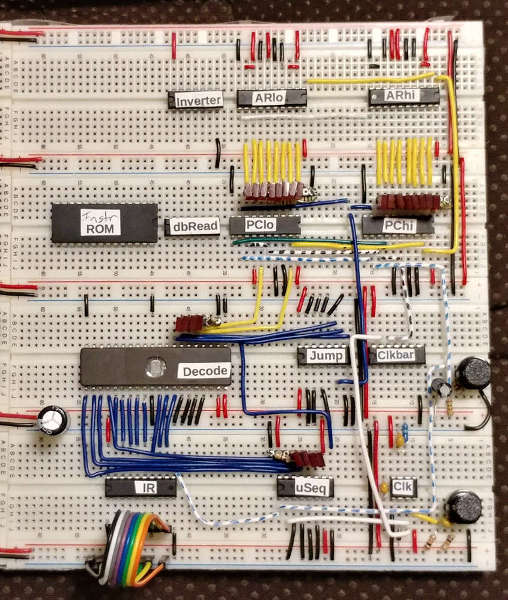
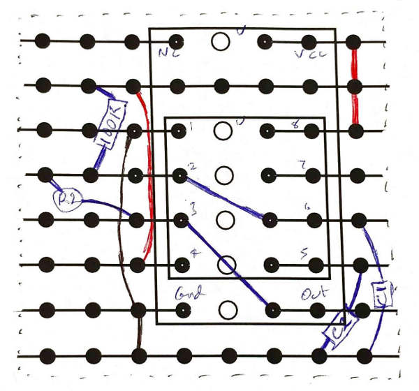

## Introduction

This is my working journal for the CSCvon8 CPU. It goes from when I first
conceived of a design on paper through to soldering the components on a
PCB and running real instructions, and beyond. I didn't write it for public
consumption; the journal helps me keep track of what I'm doing, what issues
I still need to address etc. Anyway, read on for weeks of frustration and
occasional success ...

## Thu 21 Mar 14:47:32 AEST 2019

I've created a new CPU design which allows instructions in RAM and ROM.
It's a microcoded design. It should take about 20 TTL chips.
I've started designing the microcode and writing the script to generate
the microcode ROM from this input file.

## Fri 22 Mar 09:35:49 AEST 2019

I thought I'd backed up all my ucode.rom generating Perl code yesterday
to my nextCloud, but it didn't happen. Damn. So this morning, I've built
the Verilog version of the new CPU. I'm sure that I've got the
control lines from the decoder different to what I had yesterday.

However, I've been able to run my first hi-level instruction LDA $23,
which consists of loading the IR from location $0000, incrementing the PC,
loading A from location $0001, incrementing the PC and resetting the
microsequencer to 0. Also, LDB $45 works.

## Fri 22 Mar 15:18:19 AEST 2019

Just built a list of 74HC chips available at Element14. I've spotted
the 74HC574. It's an 8-bit register with tri-state output (active low OE)
and an edge-triggered low-to-high load line. This will be good for all the
registers in the design: AH, AL, IR, A and B.

I want to do indexed addressing, e.g. LDA $HHLL,B. Stored as a 3-byte
instruction. To do this, I'll need to use the ALU for the 16-bit addition.
Obviously, the least number of chips is still a goal.

Given that we now have registers with tri-state output, can we can send the
AH register and the A register in as the first ALU argument. Can we do this
as a microsequence:

```
	Load IR with Mem[PC++]
	Load AH with Mem[PC++]		# Actually get the low address into AH
	AL= AH+B via the ALU with carry output
	Load AH with Mem[PC++]		# Now the high address byte
	AH= AH+0+carry in
	Load A with Mem[AR]
```

I thought I could optimise this by sending the data bus straight into the
ALU, but then the ALU output has to come out on the data bus, so that won't
work.

Also a problem: I really need to buffer the carry between the microinstructions.
How to do this without putting more chips into the design? Maybe I have to
bring back the Flags register and somehow lose the Jump logic chip?

OK, so I'm thinking this is going to be a real PITA to implement. How about
$HH00,B indexed addressing? I still have a spare control
bit. How about a 2-bit address bus selector:

```
	00: PC value
	01: AH/AL
	10: AH/A
	11: AH/B
```

I just realised that I can also do ($HHLL),B by doing:

```
	Load Mem[PC++] into AH
	Load Mem[PC++] into AL
	Load Mem[AR] into AH
	Load Mem[AH/B] into wherever
```

It means yet another multiplexer unfortunately. I don't think this is
going to be built with real chips, it's too complex. OK, I've added
this to the Verilog design and checked that the couple of instructions
I've already got still work. Yes they do. The control lines are now:

 - uSreset, PCincr, AddrOp(2), JumpOp(2), DbusOp(2), LoadOp(3), ALUop(5)

But it does mean I need one 3:8 demux, three 2:4 demuxers, sigh.
And because the 74HC161 PC chips don't do tri-state, I need two
buffer chips to make the PC output tri-state. So:

```
32Kx8 RAM	LY62256 32Kx8 SRAM
32Kx8 ROM	28C256 32Kx8 EEPROM
UART		UM245R
2Mx16 ALU	M27C322 2Mx16 EPROM
AH		74HC574
AL		74HC574
IR		74HC574
A		74HC574
B		74HC574
PC		Four 74HC161
PC buffer	Two 74HC241
Jump logic	74HC153
4Kx16 Decode	M27C1024 64Kx16 EEPROM
uSeq counter	74HC161
LoadOp demux	74HC238
DbusOp demux	Half of 74HC139
AddrOp demux	Half of 74HC139
```

Total: 20?? Surely this isn't right. No clock yet.

Ah, I'll need a way to invert the msb of the address to enable RAM/ROM.
separately. Need to find a 4Kx16 EEPROM still.

## Sat 23 Mar 09:57:44 AEST 2019

OK, so I decided to rewrite the microcode generator. Then I decided to
start work on the assembler. Now I have these instructions and they
seem to work.

 - EQU, NOP, LCA, LCB, OUTA, OUTB, STA, STB, LDA, LDB, A=0, B=0, A=B,
   B=A, A=-A, B=-B, JMP

There were a few bugs along the way, mainly microcode ones! But overall
it's going well. I'm wondering if 256 instructions is enough.

## Sat 23 Mar 13:18:02 AEST 2019

I've got the indexed instructions to work, and I've converted most of
the example assembly programs. Now I'm stuck on JSR/RTS. The PC's
value isn't connected to the data bus, so the assembler is going to have
to help out.

Question: do I want to have single-call functions or multi-call functions?
If the latter, do we want recursion or just call from many callers?
Recursion would require some form of stack. Multiple callers would just
need a "caller-id" idea like the existing CSCv2 has.

I'm thinking of a JSR which converts into two real instructions, and a
single RTS instruction.

```
	RTS $XXXX: Load the address from $XXXX, $XXX+1 and jump to it.
		   Would probably destroy B in the process.

	SRA means store return address.
	SRA $CCCC $XXXX (yes, 5 bytes): Store the return address $CCCC
			at location $XXXX, $XXXX+1. Would probably
			destroy B in the process.
```

So the assembler would choose two adjacent RAM locations for each function.
A JSR would store the return address in these RAM locations and jump to the
function. An RTS would jump to the return address in these RAM locations.

For multi-call functions, we could have the instructions SRAB and RTSB,
which would be store return address at $XX00,B, and return to address at
$XX00,B.

I can tell that implementing this isn't going to be fun!
OK, I've done SRA and RTS in the microcode and hand-coded some examples
to test. Now I've got to add special handling to the assembler for both.
Example:

```
	JSR fred	Allocate some RAM for the return address.
			Do SRA fred, then tack on the return address.
	RTS fred	Don't actually use fred, find fred's return address
			location and use that instead.
```

## Sat 23 Mar 14:25:26 AEST 2019


```
Here's a program that works:
	SRA printA
	JMP printA
	LCA 'F'
	OUTA
x:	JMP x
	NOP
printA: LCA 'A'
	OUTA
	RTS printA
```

Except that I have to store PC+8 in the SRA stream, and the SRA
must be followed by a JMP. Looks like I'll just merge the two and
make a single JSR instruction which will be seven (7!) bytes long:

```
	JSR store address, return address, function address
```

Argh! Alright, done and it works but it is SO ugly. Sigh.

## Sat 23 Mar 17:14:01 AEST 2019

I've brought example09 over, which uses JSR/RTS. I've also just got
minsky.s working as well, yay!

## Sat 23 Mar 17:37:53 AEST 2019

I've brought the clc compiler over and made enough changes to compile
himinsky.cl. I had to change the parsing in cas to parse the output.
I just checked: all the assembly examples still work. But the himinsky.s
output isn't working yet. Need to check the .s file first!

The loop that prints out the spaces and the star is working. But it looks
like X isn't being decremented. It stays at the same initial value.

Yes, I hadn't properly changed clc. It now works for all six example .cl
programs from the Examples area. Yay!!

## Sun 24 Mar 10:26:05 AEST 2019

I just RCS tagged all the current Verilog files with ALUROM. This is because
I have written a new ALU in Verilog instead of using a ROM. I've just
modified newcsv8.v to use this ALU, and have checked it in as version 1.12.
All the Examples/example*.s work, but minsky.s doesn't work. It looks like
something is going wrong with negative results. Not sure if it's the result
or the flags yet. I wonder if I could write three FOR loops in Verilog to
get out all the results and flags, then compare against the same for the ROM
version.

Working on diffing the results. I've fixed a few, live divide by zero.
Now up to Op 20, A<<B. OK, I've fixed pretty much as much as I want to.
There are different interpretations on how to error with BCD, and how to
error with very big << shifts, but all the Examples/*.s and Examples/*.cl
now run.

Still a lot of microinstructions to write! But at least, if I wanted to
try to synthesize it, I've got a smaller ALU now.

## Mon 25 Mar 13:41:16 AEST 2019

The only things I could find from Friday's work were the diagram and the
initial documents, so I've copied those into the directory with the
weekend's work. I might start on the KiCad schematic, so I can see
exactly what chips I need & where to put them.

## Mon 25 Mar 20:33:00 AEST 2019

Working on the KiCad schematic. Things to add:

```
Addressing: control lines for the PC buffers, CP and OE for ARhi & ARlo.

ALU_Data: CP and OE for Areg and Breg
	Some lines on the ALU ROM

Memory and IO: WE and RD lines for the UART
	OE, WE and CS lines for the RAM
	OE, WE and CS lines for the ROM

Decode: some control lines on the Decode ROM
	CP and OE for the IR
```

## Tue 26 Mar 03:03:02 AEST 2019

Awake with a crazy idea. Right now we have a fair bit of decode logic:

```
LoadOp demux: 74HC238, produces eight control lines
DbusOp demux: Half of 74HC139, produces four control lines
AddrOp demux: Half of 74HC139, produces four control lines
```

That's two chips which produce sixteen control lines: actually fourteen
as some are no-ops. Why not just have a second Decode ROM to produce these
lines. We could then lose the 74HC238 and the 74HC139.

OK, so we'd save a single chip. Damn, I thought it would be better than
this. Oh well.

## Tue 26 Mar 06:28:36 AEST 2019

I added the 74HC238 and 74HC139 multiplexers last night. The AddrOp mux
isn't going to work, because I'm enabling the A and B registers but I
need them for the ALU operation. For example, if I do:

```
	STA $8000
```

then I need to assert AH/AL and not A and not B, so A's value is high-Z
and there is nothing to send into the ALU to place on the data bus.

What it means, therefore, if I want to do indexed addressing, e.g. $8000,B,
that I need to do AL=B through the data bus first. So I should be able to
do this in microcode and not in hardware.

Also, I think I need an inverter for the RAM/ROM CS chip select line and,
because of the above change, and inverter for the PC/AR CS chip select line.
Oh well, one more chip,sigh.

## Tue 26 Mar 09:48:20 AEST 2019


OK, now rewriting the microcode to not use AR,B. I've got the two existing
indexed operations working. Now on to JSR and RTS and I've fouled up somewhere.
Right, fixed that up. I also changed the Verilog to only use a single line
for the address bus control, not two lines for AddrOp. So now we have a spare
control line!!

## Tue 26 Mar 10:58:21 AEST 2019

I've made a first go at completing the KiCad schematic. We have left over:

 - half a 74HC153 4:1 mux
 - half a 74HC139 2:4 demux
 - four inverters

The two inverters I've used are:

 - convert address bus adr15 into chip select for ROM and RAM
 - convert PCaddr enable line for both PC and AR (~PCaddr for AR)

I'd love to find a way to use those spare halves to replace the inverter!
At present it is 22 chips including the clock crystal. Sigh. The PC itself
is costing six chips!!!

I asked on Hackaday and they suggested the 74HC593 which is an 8-bit
register/counter with tri-state. The only drawback is that it reads/writes
on the same port. I'll have to think if I can use this. Would drop the
chip count from six to two chips for the PC.

It could be possible. Looking at the microcode for a jump instruction:

```
61 JA!=B: MEMresult AHload PCincr
          MEMresult ALload PCincr
          ALUresult A-Bspecial AR JumpZero uSreset
```

We load AR with the address. We use the data bus to calculate A-B
but only for the flags result. The jump logic then tells the PC to
load a new value and we reset the microsequencer.

So, yes we could wire up two 74HC593s directly to the address bus.
I'll think about this some more.

Here's what I think is the wiring:

```
Gnd: G, RCKEN#, CCKEN
Vcc: CCLR#
Clk: CCK, RCK
PCena: G#
PCload: CLOAD#
PCincr: CCKEN#
```

RCO# from low chip to CCKEN# on high chip. RCO# on high chip is NC.

## Tue 26 Mar 15:22:28 AEST 2019

Just noticed in the existing design that PCincr isn't connected to the
161s! Also looked at the waveform diagram in the datasheet and it looks
like PCincr is active high and connected to CET. But with the 593s it will
be active low and connected to CLOAD#.

Luckily, the Decode ROM looks after this so I'll only have to redo
the microcode generation if required. Technically, it's required now because
of the 161s :-)

Just realised, the 593s have both G and G# to enable output, so we don't
need an inverter to separate the PC and AR on the address bus. That's one
inverter removed.

Now can I create an inverter for the A15 address line so I can drive RAM
and ROM, using the 139 2:4 demux half that is left? Or the 153 4:1 mux?
I think so. That would bring the total chip count down to 17! Yay!

Done and tested with all the Example .s files.

## Tue 26 Mar 21:33:54 AEST 2019

I've brought the Docs and Figs up to date, and extended the coverage
of the microsequences in the documentation. I've also started to call
the design the CSCvon8 CPU, as it's crazy small, a von Neumann architecture
and an 8-bit CPU.

## Wed 27 Mar 10:13:58 AEST 2019

I have written some more documentation and renamed everywhere I could
think of with the CSCvon8 name. It's getting close to be ready for
release on GitHub. OK, released on Github.

I should try to do a timing analysis of the design to see what sort of
maximum clock frequency I can expect.

Longest path is Clock -> PC -> RAM/ROM -> IR -> Decode

```
	PC  108nS
        RAM  70nS (ignore, lower than ROM)
	ROM 150nS
        IR   13nS
      Decode 60nS
      -----------
      Total 330nS So that would be about 3MHz, yay, faster than 1Mhz 6502!
```

Fixed up some schematic DRC problems.

## Thu 28 Mar 06:35:09 AEST 2019

Spent sone time last night playing with PCBnew in KiCad and freerouter.
I think I've got the hang of it, but of course I'm sure I have missed
a few things.

Buy HCT as they are more compatible with LS, esp. if I have to buy two
74LS593s.

We need: coupling capacitors, a reset line, a hand-toggle for the clock,
a jumper to disable the on-board clock. Look for anything on Nibbler and
Gigatron which we should have.

Looking at oscillators on Element14, perhaps one of these:

```
QX14T50B3.686400B50TT	3.68MHz
QX14T50B2.457600B50TT 	2.45MHz
```

Same package dimensions, so I could do the PCB and try both.

We can wire CCLR# on the PC chips to ground to reset the counter. Done.
I've added the reset circuit, the single-step clock circuit and the
bypass caps to the schematic on a new sheet. Now I might play with
the PCB.

For now I won't worry about getting the exact footprints right, just
concentrate on the workflow.

In schematic, do DRC check, run Cvpcb to associate footprints. Export
the netlist. Go to PCBnew. Select everything, delete everything. Import
the netlist. Lay out the footprints. Try to minimise the ratsnest as you do it.
Orient things: ICs, caps, resistors where possible.
Select the edge layer, and use the dashed diagonal line tool on the right
to draw the edge layer. Double-click on the last point.
Do the copper pours now before Freeroute!
Now export and use Freeroute to route the nets.
Back import the session, hit b to rebuild something.
Run a DRC check.

Copper pours: select the F.Cu layer on the right. Click on Add Filled Zones
tool on the right. Click on the top-left edge layer. Choose GND net and the
F.Cu layer (already chosen). Ensure you have thermal relief in the middle.
Click on the other corners and double-click on the final corner.

To copy to the back copper layer, right-click on the edge. Choose Zones ->
Duplicate Zone, and choose B.Cu in the dialog box.

Got back, right-click on the edge. Choose each zone in turn and Fill Zones.
Then on the left, use the Show Filled Areas button to show them.

To rip up all the tracks, select everything. In the Block Operations dialog,
only tick Tracks. Then right-click and Delete Block.

OK, I'm pretty happy with the results. Now, I need to really cross-check:

  - is the schematic correct, what wiring mistakes have I made?
  - select the absolute correct footprints and view the board and
    the 3D model before running Freeroute.

I'd also like to synthesize the Verilog on to the ULX3S board that I have.
There should be enough block RAM to synthesize the ROM ALU as well as the
Decode ROM and the RAM & ROM.

## Thu 28 Mar 12:26:24 AEST 2019

Component shopping

```
RAM	LY62256		element14 $3.57
ROM  	28C256		not at element14, eBay $1.64
UART   	UM245R 		Already got it
ALU  	M27C322		not at element14, eBay around $12
ARhi  	74HCT574 	element14 $1.11
ARlo  	74HCT574 	element14 $1.11
IR  	74HCT574 	element14 $1.11
A reg  	74HCT574  	element14 $1.11
Breg  	74HCT574  	element14 $1.11
PC  2x	74LS593		X-On eBay sells 74LS593 for $30ea
Jump 	74HCT153  	DIPs not at element14, eBay $20 10 pieces
Decode 	M27C1024	not at element14, eBay around $10
uSeq  	74HCT161 	element14 $0.37
Other 	74HCT139	element14 $1.36
	74HCT238	element14 $1.87
Crystal QX14T50B3.686	element14 $4.78
```

Just ordered some of the stuff from utsource, mainly the memory and
stuff I can't get from element14.

I tried to synthesize the system for the ULX3S but yosys didn't like the
RAM & ROM and threw everything away. So I might try with Verilator first.

## Thu 28 Mar 22:05:28 AEST 2019

Actually I tried with yosys. The ALU ROM causes yosys to die with a malloc()
error, so I'm back using the other ALU. There's a loop involving the BCDcarry,
so I've tweaked that out for now. I can compile it with Verilator. Now I'm
comparing it against the Icarus VCD waveforms and they are different. Not
sure why yet.

OK, some progress. In ~/Z2 I have a version which works both with Icarus
and with Verilator. I need to merge this back into the Git version, and
then worry about the ULX3S version.

## Fri 29 Mar 06:12:52 AEST 2019

Imported the Verilator version back into my NNN folder and made sure
it all still works with Icarus. Doing some yosys investigation. I have a
script called runthruyosys that does:

```
	yosys -p 'synth_ecp5; write_verilog' $1
```

With a ram module from the web that does this:

```
  output reg [WordSize-1:0] rdata;
  always @(posedge clk) begin
        if (wen) mem[addr] <= wdata;
        rdata <= mem[addr];
  end
```

This gets synthesized to some ECP5_DP16KD blocks. If I make the reg rdata
and do assign rdata = mem[addr]; instead, I get:
Mapping to bram type $__ECP5_DP16KD failed.

I've changed the CSCvon8 ram.v around to a reg and <=, and both the Icarus
and the Verilator simulation fail. There would be a clock delay in getting
the output of the RAM now. Maybe I've got to do the thing I did with CSCv2
and generate a double-speed clock for the memory devices, then use the single
clock for the system.

Now I have double-clocked RAM and ROM devices that are working in Verilator
but not in Icarus! But they do synthesize to block RAM with yosys. I have no
idea how to debug this, but I might try building the ULX3S version again.

It took over 10 minutes to synthesize, the sim annealing took ages with the
block RAM. Also, it came under the 12MHz timing limit with 3MHz. When minsky
runs, I get:

```
 *  		with 0x04 after the \n
    *
       *
          *
             *
                *
```

i.e. just a linear increase. However, it does show that the code is running,
i.e. the IR, ROM, uSeq and control lines are doing something.

Ideas to speed up the synthesis and hit timing: remove the MUL, DIV, MOD,
make the RAM/ROM smaller, e.g. 1K each not 32K each. Yes, that helps a lot
with synth speed but still the same results. I could use the LEDs and the
push buttons to help debug, I suppose.

OK, trying example04 on a loop on the ULX3S, and it works fine. This is
just incrementing B and doing a test. Hmm, example05 on a loop doesn't.
This uses indexed RAM. I don't see any UART action, but the LEDs show the
PC is changing.

So I've changed example04 to print out a char, store at $2000, read it back
and print it out again. This works for Icarus, Verilator and ULX3S. But
example05 doesn't, which uses RAM indexing.

I think I have pinpointed the problem but not the solution. It's because
of the reg output on the ROM modules and the fact that we are double clocking
them now. We are STA $8020, so $8020 is on the address bus. Then the uSeq
goes to phase 0 to get the next instruction. But $8020 is still on the
address bus, and therefore we fetch the instruction from $8020 and it's
$00, i.e. NOP.

Somehow I've got to deal with the reg delay through the RAM and ROM.
Very annoying!

## Sat 30 Mar 12:04:16 AEST 2019

I've given up on synthesizing to the ULX3S for now. I will have to learn
how to build Verilog code that deals with the block RAM delay, sigh.

I'm going back to the working Verilator/Icarus version and trying to put
in non-blocking keyboard reading. I've started to use the tx/rxuartlite
code from Dan Gisselquist, and I'm using curses to do the non-blocking
reads in the uartsim.cpp. I'm losing output characters because the CPU
runs too fast, and I can't dial down the CPU speed as it makes
CLOCKS_PER_BAUD too small and then the UART doesn't work.

This will probably be a problem with the real CPU. I'm happy to read NUL
characters if the UART has nothing, we can loop back in software. But
need a way to detect if the UART is busy and loop back before the OUTA
instruction. I'm using a 74LS153 4:1 mux for the jumps at present. I could
use an 8:1 mux somehow.

The 74HCT251 is an 8:1 mux with non-inverting and inverting outputs.
The ALU can generate either non-inverting and inverting inputs, so it
really depends on what the UM245R can do. Pin 22 TXE# is low when the UART
is ready to write, high if it is not ready.

We have a spare control bit from the Decode logic! So let's promote the
JumpOp to three bits. Also remember that PC has CLOAD#, active low.

Need to make ALU outputs active high now. We also have two more JumpOp
options!!! I could bring back overflow from the ALU, as there are five
spare outputs from the ALU.

I know, jump if divide/mod by zero. So we would have:

```
       JumpOp	'251 input	Inverted output meaning
	000	1		0, always jump
	001	Carry		Jump if carry
	010	Verflow		Jump if overflow
	011	Zero		Jump if zero
	100	Negative	Jump if negative
	101	Divbyzero	Jump if divide by zero
	110	TXE#		Jump if TX not ready
	111	RXF#		Jump if RX not ready
```

That's cool! Same number of chips and a lot more jump options. I won't have
time on the weekend to redo the ALU and rewire the Verilog, but I will do it
during the week I hope.

## Sat 30 Mar 13:14:22 AEST 2019

I've physically moved directories to Zvon8, so I can work on this version
without affecting the original. I should be able to `ifdef VERILATOR and
keep the original Icarus uart.v as well as the new tx/rxuartlite.v code.
That will make it faster to test the new ALU but still check that the
new jump lines are working.

## Sat 30 Mar 18:40:57 AEST 2019

I've got Icarus working and the CPU has the new jump control lines. I've
got all the Example/*.s working. I generated the ALU rom, but I haven't
fixed up the overflow and divbyzero in otheralu.v yet. Now to get Verilator
working with the new control lines. That will be more fun.

Yes, now working, but I need to L1: JNOTX L1 after OUT instructions because
Verilator now requires several clock cycles to transmit the OUT character
at 115,200 bps! I haven't fixed clc yet. Also, we now JMP $FFFF to exit(0),
it's a lot easier now that we have a whole bunch of L1: JNOTX L1 instructions.

Hmm, I've coded up the JNORX (no received data) instruction, and I've
checked that the curses rxuart code I borrowed from TTT works in TTT.
But it's not working here. It could be that the rxuart doesn't have a
control line to fetch the data in the 1-byte buffer. So I might have to
rewrite the code a bit.

## Sat 30 Mar 21:57:23 AEST 2019

I've rewritten the rxuartlite code so that there is now a strobe line
to get the data, and it resets the availability line. I've added some
new instructions and example09 now reads from the UART and echoes it back.

TODO: Replace curses with tcgetattr()/tcsetattr() because curses clears
the screen at the start and the end, which is annoying. Also, either
uartsim.cpp or rxuartlite.v is returning $FF characters which is should not
do, or I am doing something wrong. But, one step forward though!

Also todo: start to rationalise the order of the instructions; right now
they are haphazardly arranged. Maybe set aside pages of 16 instructions
for different groups of instructions?

I'll need 32 for A= ALUOP, 32 for B= ALUOP, 32 for MEM= ALUOP. Actually,
31, 31 and 32 as I won't need A=A, B=B.

## Sun 31 Mar 07:22:49 AEST 2019

Moved to tcgetattr()/tcsetattr(). The $FF bug seems to be in rxuartlite.v.
Yes, I fixed it. The code was triggering because the stop bit was being
treated as the start bit. So that's the TODO from yesterday fixed.
OK, I spent some time and I added all the ALU ops and then reorganised the
order of instructions in the microcode. Still lots more instructions to be
added, though.

## Mon  1 Apr 14:50:39 AEST 2019

I've quickly added the 74HCT251 to the schematic and rearranged the JumpOp
and ALU flag result lines. I'll need to carefully check it later. I was
considering adding the reset delay device from Gigatron, but I think my RC
circuit will do the same thing, as long as I hold the button down when I
turn it on.

Should I add a power LED? What about some LEDs on the data and address bus?
Or perhaps just some pin headers so I can add some diagnostic leads?
I'm thinking of a 200mm by 150mm PCB. Need to get prices on them.

## Mon  1 Apr 16:48:16 AEST 2019

I'm not very happy with the instruction names, so I need a way of naming
something in the microcode file that can be exported and picked up in the
cas assembler. Here are my thoughts at present.

```
LDA ALUop [Jx $XXXX]	where ALUop is one of 32 words, and seven J jumps
	   JC			carry set
	   JV			overflow set
	   JZ			zero set
	   JN			negative set
	   JD			divbyzero set
	   JO			output not ready
	   JI			input not ready
```

Hmm, because each one has to be microcoded, I can't put all the jump versions
in as I'd run out of instructions. So I'll have to limit the jump options.
Say ADDs with JC, DIV and MODs with JD

```
LCA $XX			load constant
LDA $XXXX		load from memory
LDA $XXXX,B		load indexed from memory
[ all the above with B not A ]

STO ALUop $XXXX		store ALUop in $XXXX, optional jump
STO ALUop $XXXX,B	store ALUop in $XXXX indexed with B, optional jump

INA			Load UART into A
INB			Load UART into B
INR $XXXX		Load UART into RAM
INR $XXXX,X		Load UART into RAM indexed with B
OUT ALUop [Jxx]		Output the ALUop and optional jump

Jxx $XXXX		jump to $XXXX, eight jumps:
JMP			Always jump
JEQ			Jump if A==B
JNE			Jump if A!=B
JGT			Jump if A>B
JLT			Jump if A<B
JGE			Jump if A>=B
JLE			Jump if A<=B
JOU			Jump if output is not ready (unavailable)
JIU			Jump if input is unavailable

JSR $XXXX $CCCC $SSSS. 	Store $XXXX at $CCCC then jump to $SSSS.

RTS $CCCC		Load $XXXX from $XXXX and jump to $XXXX.

NOP
```

Maybe I can encode the name in the microcode file, e.g. LDA:A/B:JD, or LCA
or LDA or LDA:,B. Have some lookup tables in cas.

Make a hash of keywords, Split each line into words, remove the label.
Build a list of keywords separated by colons. Look up the result in
an instruction table. Recognise $XXXX, $XX and labels. Check for consistency
between # of instruction bytes and the addresses & constants on the line.

Just realised that Kicad has output labels and the ~ prefix marks lines as
active low, so I've just added these to the schematic. I'm also thinking, now
that the design is solid, to write a csim for this new CSCvon8 architecture.

## Mon  1 Apr 20:16:34 AEST 2019

I've written a csim, but actually the Verilator version is faster to load
and run! Also, not all the examples are running in Verilator. I wonder if
my microcode rewrite isn't perfect.

Yes, the new microcode breaks Examples/example03.s.
Hah, used csim to find the bugs. Was all the STA/STB
instructions, I'd forgot to add ARena to them.

I've just rewritten the microcode and cas to change the instruction syntax
to be like what I suggested just before. I've converted all the Example/*.s
files. They run under Verilator.

However, there's a csim bug as it doesn't act like Verilator for:
Examples/example09.s and Examples/minsky.s. So that's something to
investigate.

Modified clc to speak the new assembly syntax. All the .cl examples compile,
assemble and run.

## Tue  2 Apr 06:26:02 AEST 2019

I'll leave csim aside for now. Might try to work on the schematic again
today & try to really make sure it has no bugs in it. I see that Gigatron
uses global labels H and L for logic high/low instead of Vcc, Gnd. I might
use that, make it look nicer. I will put in some pin headers so I can add some
diagnostic leads. Also, add sheet information and other textual information
to the schematic.

## Tue  2 Apr 11:27:09 AEST 2019

I added sheet information and other textual information, pin headers for
data bus, address bus, IR and uSeq counter. That should be enough. Then
I printed it out and went over every chip for correct pins and function.
I found some big issues. Most importantly the 74LS574 load line is active
HIGH, not active low. So most of the XXload lines need to be changed.

Oh no!!! The 74LS138 3:8 demux only outputs active low lines, so I can't
send them to IRload, Aload, Bload, AHload and ALload! Argh!!!

So it's a bit tricky now. I need:

 - IRload, Aload, Bload, AHload and ALload to be active high
 - MEMload and IOload 			   to be active low

Damnit, I think I'm going to have to add a hex inverter chip, sigh!

## Tue  2 Apr 14:29:55 AEST 2019

Added the inverter, made some more small schematic changes. Now I've started
a trial PCB layout to see where the big clusters of lines are. Running
freeroute at the moment. I've moved a few things around to make it cleaner,
and it's looking OK at the moment.

## Tue  2 Apr 20:09:52 AEST 2019

I've gone back in and added two extra pins per header, one for a space and
one for a ground pin. We have: IR, uSeq, address bus and data bus pin headers.
Before, I left freeroute running for about an hour and it got down to about
35 vias from 70, which is excellent. Hopefully I'll get the same result now.

No, got down to about 42 this time. That's still quite good, and the 3D
view of the PCB is impressive. What I now need to do is to get the chips
and other components and ensure that I'm using the right footprint for each
one. Then I might be able to shrink the board a little bit.

Another big question: I'm going to have 32K of ROM for this thing. I want
to get to a point where I can boot from ROM, download and run programs in
RAM. So I need at least a front-end program to download over the UART,
and perhaps a memory inspector? And that leads to another question, am I
going to write this in asm, in the clc language, or am I going to port the
h2 compiler over to this architecture?

Can I run csim connected to a pseudo-tty and then connect minicom to the
pseudo-tty,so I get the same form of interface that I would with the real
hardware. Then, what is the download structure going to look like?

I think the UM254R defaults to 9600, wonder if this can be controlled by the
USB. So, 960 chars/second, that's about 1K per second. If we can send 8-bit
binary then we could send a 32K image in say 40 seconds.

Perhaps send: size in 2 bytes followed by the raw bytes? The loader puts the
size in FFFE/FFFF, and decrements until the count goes to zero. Would be
nice and easy.

Memory dumper: it's not going to be a disassembler, no, but probably just
a hex dump given a range of RAM.

```
Start: 8000
End: 8020
64 77 00 31 62 80 03 41 80 06 f0 ff fe 00 41 00
9b 62 80 02 41 80 06 f0 ff fe 00 4e 00 9b 60 3d
```

Something like that. Then we can cut and paste this into disasm.
Would be nice to have a well-defined entry point in ROM that we can
jump to, that gives a command prompt and does things.

```
> L 8000	Load over UART into this location
> D 8000 [8020]	Dump memory. If only one number, dump 16 bytes
> C 8000	Change memory. Enter several hex pairs, end with a newline.
> R 8000	Run (JSR) starting at 8000
> X		Assume that we fell into the monitor from a breakpoint,
		exit back to the running program.
```

Now we need to start defining some monitor locations :-)
Also, need to modify cas so we can set the PC, perhaps ORG? Also, define
some strings, but put them on a page start so B can access them?

```
fred:	ORG $8000
	...
	...
hello	STR "Hello there, how are you?"
```

Now we have to deal with spaces on the input lines, of course.

Yes, csim and Perl can do ptys:

```
use IO::Pty;
$pty = new IO::Pty;
print("name is ", $pty->ttyname(), "\n"); sleep(10);
foreach $val (1..10) { print $pty "$val\n"; }
sleep(5);
close($pty);
```

which can be read from minicom -p /dev/pts/2

## Wed  3 Apr 13:34:40 AEST 2019

I've rewritten the parser in cas so it can deal with ' ', "hello" and
is more flexible. I forgot that I changed A>>BL into A>>B, so I had
to fix some examples and the clc.

Just added ORG and STR pseudo-ops to cas. But I think I'll have to redo
STR as I just write the ASCII directly into the instruction stream.
What I should do is wait until after the first pass, then put each
string in its own page starting at offset zero on that page. Let's
leave it for now and see how bad the code is to print out the string.

Here's my code to print out a string, so far:

```
fred:	JMP start
hello:	STR "ABCDEFGH"
start:	LCB hello		# Start at the base of hello
loop:	LDA hello,B		# Get a character
	LDA A JZ end		# Exit if NUL
	OUT A			# Print it out
L1:	JOU L1			# Wait for UART
	LDB B+1
	JMP loop
end:	LCA $0A			# Finally print a newline
	OUT A
L2:	JOU L2
	JMP $FFFF
```

That's not too bad. I'll add a HEX pseudo-op as well.

If I start writing more pseudo-ops, I'll think about writing a subroutine
table so I can lookup and run the code for each pseudo-op out of the table.

Fix a cas bug with parsing ,B. Fixed the csim bug, which was a JumpOp bug.
I now generate a storable alu.hex file if it doesn't exist, which speeds
csim up.

Hah, I added "." to mean current PC value to cas, so I can JOU .
Very original Unix assembler, there.

## Thu  4 Apr 09:30:20 AEST 2019

I fixed up the UART input in csim. I then added in the pty code. The pty
output works fine, but pty input doesn't work yet. When I hit a key,
multiple copies of that key go into csim. Not sure why yet.

Fixed. I can call cbreak on the $IN and leave it on now. Turning it on and
off was causing the problem. So now I have a sim which I can access through
minicom just like I will be able to with the real hardware, oh except not
simulating the 9600bps speed :)

I've implemented LIA and LIB instructions, which all access through a pointer
to a memory location. Assume that $F000/$F001 holds a pointer to
string: STR "Hello", then LIA $F000 will load "H" into A.

## Thu  4 Apr 11:21:15 AEST 2019

Back to the idea of a monitor. I now have puts() working with the LIA
instruction. So, I could create some subroutines in monitor ROM that can
be used by RAM programs :-) Example: convert two ASCII hex digits in RAM
into a byte in RAM.

## Fri  5 Apr 13:49:31 AEST 2019

YADI: Yet another design idea. Right now, we can't jump during a microsequence,
and we have an external Jump logic chip. So, use a bigger Decode ROM and move
the jump logic into the ROM.

Inputs to new Decode ROM:

 - IR, 8 bits
 - phase, 4 bits
 - DNZVC, 5 bits
 - two UART status bits

So we need a 19-bit or 512Kx16 ROM.

Outputs from the new Decode ROM:

 - ALUop, 5 bits
 - LoadOp, 3 bits		- reader from the data bus
 - DbusOp, 2 bits		- writer to the data bus
 - new phase, 4 bits
 - ARena, 1 bit			- who writes on the address bus
 - PCincr, 1 bit		- increment the PC
 - PCload, 1 bit		- load the PC

Damn that's 17 bits. We really do need to have: increment PC, load PC,
leave PC as it is. Can we get away with four bits by merging the AR
control somehow.

```
  00	PCena		- Just for symmetry
  00	PCena PCincr	- Put PC on the address bus and increment it
			  (used to load the instruction and following bytes)
  01	ARena		- Put AR on the data bus
			  (used to access memory, read/write)
  10	ARena PCload	- Load PC from the AR (used for jumps)
```

Yes, looks like we could do it.

The idea would be to move the phase manually as part of each microinstruction.
For example, we could OUT A to the UART and get the microsequence to loop
until the UART was ready, then send the value to the UART. Ditto for the
UART reading.

Similarly, we could do JNA (jump if A is negative) by doing the "A" ALUop,
not writing to the data bus, but then moving the microsequence to the
"load PC" section if we see the N flag in the ALU status.

Something to watch out for, especially in the last paragraph. There would
be metastability as the Decode ROM controls the ALU ROM, whose output comes
back to the Decode ROM. Oh, we don't need a uSeq counter any more, so we
only need a register for the microsequence counter, and it will always load
from the Deode ROM on every clock cycle. So, can we use an 8-bit register
for the uSeq phase: 4 bits for the sequence, 4 bits of NVZC status from the
ALU. That would get rid of the metastability.

But ... I was hoping to lose the Jump logic chip. Now I need to decode
the AR/PC control lines and the unused 2:4 demux half is not going to
be able to do this. So, no savings in chips. Well, it's a nice idea but
I don't think it's worth a redesign if I'm not saving chips.

## Fri  5 Apr 19:59:22 AEST 2019

I thought about things while we were out. At present:

 - ALUop, 5 bits
 - LoadOp, 3 bits, reader from the data bus
 - DbusOp, 2 bits, writer to the data bus
 - new phase, 4 bits
 - ARena, 1 bit, who writes on the address bus
 - PCincr, 1 bit, increment the PC
 - PCload, 1 bit, load the PC

17 bits total.

Two ways to shave a bit off:
 1. Drop ALUop to 4 bits, so only 16 operations. This is possible
    because we can now jump within the microsequence. This would
    be very reminiscent of CSCv2. Alternatively,
 2. Only have 3 bits for the phase, so only eight microinstructions in
    each high-level instruction. I'll have to see if this is possible.
    Both JSR and RTS need more than 8 microinstructions. I could go back
    to the idea of "Load Return Address" into AR, then "Jump to AR".
    Similarly, "Save Return Address" then JMP to do a JSR.

I think I prefer option 1. Main question: can we do a 16-bit add with
a carry, e.g.

```
	LDA Alo		
	LDB Blo
	STO A+B Reslo	# Add & store low byte, save the carry flag
	LDA Ahi
	LDB Bhi
	STO A+BC Reshi	# Add & store high byte and any carry
```

It would mean that I need two add ALU operations, and two subtract ALU
operations, A+B, A+B+1, A-B, A-B-1. Here are the CSCv2 ALU operations:

```
    # A + B decimal
    # A - B decimal
    # A & B
    # A | B
    # A ^ B
    # A + 1				Probably B+1 is better
    # 0, flags set to B's value		We can reuse this as A+B+1
    # 0
    # A + B binary
    # A - B binary
    # A
    # B
    # A * B binary, low nibble
    # A * B binary, high nibble
    # A / B binary
    # A % B binary
```

There are no shifts any more! So, no I don't like the 4-bit ALUop option
much either, sigh.

Another idea I had was to let the uSeq increment by default, but jump to
a 4-bit phase which is 1xxx, so the msb is high and we only need 3 bits
of jump phase. But now we need control lines: reset phase to zero, load
phase to 1xxx, which is actually CCxxx or five bits, so it's actually worse.

Well, it was worth some idle exploring of the potential of a phase+flags
register, but I can't see a way to save chips and keep the current
functionality.

## Fri  5 Apr 20:47:25 AEST 2019

Looking at DigiKey as well as Element14. There are 2.3mm wide rectangular LEDs.
I was thinking of putting black tape between each one to isolate adjacent
light, to make arrays of 4, 8 and 16 LEDs. I'd be happy to use a single
(or a few) dropping resistors. Then I can plug them into the sockets. And
I can plug pin headers into the sockets if I need test points.

Hmm, looks like I can buy everything I need at DigiKey, so that's what
I'll probably do. Just thinking, perhaps I should socket the oscillator
so I can buy different speed ones in case I've got the speed wrong!

## Sat  6 Apr 09:53:36 AEST 2019

I've just put in my DigiKey order, AUS$88 roughly. I've bought a 1MHz and
3.54MHz oscillator. I now have dimensions for pretty much all things.

I've redone the PCB layout, added some silk screen labels and also made the
Vcc and Gnd tracks wider. I'm now running freeroute (yet) again. It's done,
and now I have a lovely PCB with copper fills and the 3D view looks nice.
There's a PCB manufacturer in Molendinar, so I've sent them an e-mail
asking for a quote.

## Sun  7 Apr 20:40:36 AEST 2019

I wrote a tool called net2human to take the Schematic.net file and convert
it into a text file so I can read it and easily see which IC pins are
connected to which nets. Useful names, e.g.

```
	RAM pin 13, HM62256BLP-7 D2: d2
```

i.e the D2 pin on the RAM is connected to the d2 net. I went through all
the chip pins and they are all connected fine.

After that, I thought again about synthesizing block RAM. So I wrote a
really cut-down CPU with ROM and Decode ROM, and posted a Reddit FPGA
question on how to convert the output from a combinational result to a
clocked and hence delayed result. Apart from that, I haven't done much
else. I know I should work on the monitor ROM: dump memory, upload a
new program to RAM, but it's tedious :-) I'm looking forward to the
parts turning up. I can play with individual chips on breadboard first.

## Mon  8 Apr 09:24:37 AEST 2019

Last night I decided to sit down and try to nut out a solution to
the clocked block RAM issue. The problem: my normal Verilog memory
has a combinational result:

```
	assign result= mem[address];
```

But yosys doesn't synthesize this to block RAM, because the output
has to be clocked:

```
  output reg [7:0] result;
  reg [7:0] mem [0:255];
  always @(posedge i_clk) begin
    if (wr_stb)
      mem[address] <= data;
    result <= mem[address];
  end
```

So I built a trivial microsequenced CPU with no ALU, just this set of
microsequences:

```
   0 NOP: IRload PCincr         Do nothing except increment the PC
          uSreset
   1 LCX: IRload PCincr         Load X with byte after instruction
          Xload uSreset
   2 LDX: IRload PCincr         Load X with ROM[byte after instruction]
          ARload PCincr
          ARena Xload uSreset
   3 STX: IRload PCincr         Store X to ROM[byte after instruction]
          ARload PCincr                 OK, so ROM is also RAM-like!
          ARena Xena uSreset
   4 JMP: IRload PCincr         Jump: set PC's value to byte after instruction
          ARload PCincr
          ARena PCload uSreset
```

This worked with the original "assign result= mem[address];" memory
component, but not with the clocked "result <= mem[address];" because
of the delay in getting the ROM output. I asked on Reddit for ideas,
and one person said you need to have a read_strobe line into the ROM
and a data_valid line out.

Given that the CPU is microsequenced, I realised that I could just
rewrite the microcode to put in some delays to allow the results
of the ROM and the Decode ROM to propagate. Here's the new set of
microcode instructions. The starred entries are the changed ones:

```
0 NOP: IRload PCincr            Increment the PC, load the IR
       * do_nothing             (wait for the IR to be loaded)
       uSreset                  Reset the micosequencer

1 LCX: IRload PCincr            Increment the PC, load the IR
       * do_nothing             (wait for the IR to be loaded)
       Xload uSreset            Load the X register, reset the micosequencer

2 LDX: IRload PCincr            Increment the PC, load the IR
       * do_nothing             (wait for the IR to be loaded)
       ARload PCincr            Load the address reg, increment the PC
       * Arena                  Use the AR to index the ROM, wait for it
       Xload uSreset            Load the X register, reset the micosequencer

3 STX: IRload PCincr            Increment the PC, load the IR
       * do_nothing             (wait for the IR to be loaded)
       ARload PCincr            Load the address reg, increment the PC
       ARena Xena uSreset       Put X on the databus, write to ROM, reset uSeq

4 JMP: IRload PCincr            Increment the PC, load the IR
       * do_nothing             (wait for the IR to be loaded)
       ARload                   Load the address reg, no need to incr the PC
       ARena PCload uSreset     Load the PC from AR, reset the micosequencer
```

Another person said to clock the ROM at 3x the CPU, which is the same as
saying clock the CPU a 1/3 the speed of the ROM. I remembered that I had
to half-speed the CSCv2 for this reason.

I think the above solution is better because it doesn't double the
duration of every instruction:

```
	NOP: 2 -> 3 microinstructions
	LCX: 2 -> 3 microinstructions
	LDX: 3 -> 5 microinstructions
 	STX: 3 -> 4 microinstructions
	JMP: 3 -> 4 microinstructions
```

Fortunately, all of the above is only to deal with the block RAM synthesis
on an FPGA. That's not my primary concern here, as I'll be using real chips.
So I can stick to my combinational memory component for the Verilator
simulation.

## Mon  8 Apr 13:51:06 AEST 2019

Back to the monitor. Fixed an indexing bug. The ROM burner should arrive
in the next few days. The chips from Utsource are estimated to arrive
on the 13th April. Digikey: Tuesday, 09/04/2019. So I'll have a lot of
pieces to play with soon!

I wrote the code to convert 4 chars into a 16-bit address. Now I need
a SIA "Store Indexed A" instruction to store A through a pointer to memory.
Example SIA $1234, where $1234 and $1235 holds the address $5678 which is
where A needs to be stored. I need this so I can read the byte stream of
an incoming program down the UART and save it in memory starting at the
address given by the user.

Problem is, I don't have enough registers to hold everything. One solution
is to write the "STO A" instruction byte before the address in RAM, then
the address, then an RTS instruction, and then JSR to this. Self-modifying
code, in other words. But a proper SIA instruction would be better.

I took a slightly different approach. In RAM, construct a STO A addr
and a JMP back instruction. I had to add a label/HI syntax in cas so
I could access the top byte of a label's address.

## Mon  8 Apr 21:20:54 AEST 2019

Yay, I just downloaded and ran my first program over the "serial cable".
In this case, I did ./csim < infile. The executed program was this:

```
	ORG $9000		# Print out *\n over and over
	LCA '*'
	JOU .
	OUT A
	LCA '\n'
	JOU .
	OUT A
	JMP $0000
```

To do this, I put in a file L\n<addr><len><binary data>R\n where the binary
data was the assembled code above. Here is the hexdump of the file:

```
00000000  4c 0a 90 00 00 0e 60 2a  77 90 02 64 60 0a 77 90
00000010  08 64 70 90 00 52 0a
```

4c 0a is the L\n.
90 00 is the address to load the program.
00 0e is the length of the program minus 1, i.e. 0x0e or 14
The program is 60 2a 77 90 02 64 60 0a 77 90 08 64 70 90 00
which is 15 bytes. We set 14 so we go negative when we
decrement the length counter.
52 0a is the R\n.

So when I do ./csim < fred2 I see:

```
Welcome to the CSCvon8 monitor ROM

> L
> R
*
*
*
*
*
etc.
*
```

## Mon  8 Apr 22:59:50 AEST 2019

Doing some PCB pricing. OSH Park are quoting US$174.40 for a 254.2 x 88.5mm
times 3 boards. www.breadboardkiller.com.au are quoting AU$117.25 for a
250mm x 88mm board (250mm is maximum) times 5 boards. Shipping is either
AU$13 or AU$40. So they seem to be cheaper overall than OSH Park. But I
do need to bring my design down to 250mm. Should not be too hard.

## Tue  9 Apr 08:41:37 AEST 2019

I squeezed the UART to the left last night and left freeroute running. This
morning, still 29 vias. I've added back in the copper pours and updated the
version # on the silkscreen to say v2019/04/19. Breadboardkiller shipping is $40
for 4-7 days from Singapore (it seems).  I think I'll hold off on ordering the
board until the parts arrive and I can play on the breadboards with them first.

## Wed 10 Apr 11:04:32 AEST 2019

Last night I built a 4-LED array and two 8-LED arrays which work. Now playing
with the 161 counter for the uSeqencer. I think I've realised that my key
debounce curcuit isn't up to scratch. Looking at the 2-resistor 1-cap circuit
here:
https://hackaday.com/2015/12/09/embed-with-elliot-debounce-your-noisy-buttons-part-i/
I've built it with 20K, 1K, 10uF components and it works fine, drops to 0
when the button is pressed.

However, the equivalent pulse up button isn't working well. I think I will
go with the one-shot clock circuit that I had on the CSCv2 with a 555. Oh
well, yet another chip. At least it's "analog" and not logic.

Using the CSCv2 clock pulse from the actual CSCv2 board, I've set up the
161 uSeqencer and checked that it counts and resets. Now to update the
schematic again.

Argh, I couldn't find a good schematic with the new stripboard 555
circuit. I had to grep through my old web browser history to find this:
https://electronics.stackexchange.com/questions/180716/555-timer-one-shot-trigger

## Wed 10 Apr 21:27:02 AEST 2019

I've added the 555 and extra components to the schematic, and placed them
on the PCB to try and minimise the tracks. It's now in the hands of freeroute.
I do have the caps, resistors and diode to add it, but I need to get some 555s.
I've ordered 10 555s for $3.50 from eBay, arriving Monday.

## Thu 11 Apr 08:22:26 AEST 2019

Just tried out one of the 74HCT574 register chips. Works as advertised!
Just looking at the schematic, what I really need now are the 74LS593
register/counters which I'm using for the PC. There are a lot of control
lines on each one, and I need to know that I have them controlled as is
required.

Just before I throw some scribbles out.
ZIF socket: top end 4mm from pin to left edge, 10mm from pin to top edge.
	    bottom end, 4mm again to left, 7mm to bottom.

Pushbuttons: flat edge to top, left side is 1&3 wired together, right side
is 2&4 wired together.

## Fri 12 Apr 09:14:04 AEST 2019

The 74LS593s arrived yesterday. I played with one and got it to count.
I did notice that it was counting irregularly when CCLK and RCLK were
strobed at the same time. So I've started to wire up both 74LS593s (PC)
and two 74HCT574s (AR) as per the schematic, and I'll play with them.

I've ordered the 555s. What I think I will do is also set up a 161 as the
uSeq, the Decode ROM and get it to output the control lines needed for the
PC and AR. Then I can run a simple microsequence and check that it works
as advertised. This will require a fair amount of breadboard wiring. I
did some last night.

I've drawn up a schematic with a oneshot 555 & 161 sending a 00 to 0F sequence
to a 28C256 ROM which has 8 outputs. I'll only use four. They will be ARena#,
PCload#, PCincr# and Reset#. I've also confirmed that I can read and write the
ROM with the minipro software. I've also written bin2hex and hex2bin scripts
so I can hand-edit the bottom 16 bytes to be whatever control line sequence
I want. Now to wait for the 555s (Monday) and some green breadboard wire so
I can at least make it look a bit pretty when I'm testing it.

## Sat 13 Apr 10:50:09 AEST 2019

I had problems yesterday getting the oneshot 555 to clock the 74LS593s
directly to RCK and CCK. They were incrementing haphazardly. It turns out
that, because I was using the 555 circuit from the CSCv2, it was loaded so
that the output only reached 3.7V. By isolating the 55 circuit from the
CSCv2, it got to 4.7V and this clocks the 74LS593s fine. I used my
Bitscope Micro to see and measure the waveform.

It turns out that G has to be high and G# low to enable the 74LS593 output.
So I have to write G# low and connect G to ARena#.

I'm doing a breadboard test circuit with the two AR registers on the left,
the two PC 74LS593s on the right, a 161 as a counter and a ROM to output
16 different control line combinations. So I can try all the various
control line combinations in sequence to check that things will work. I'm
using the isolated CSCv2 isolated circuit for now.

A quick test, wire the four 161 output bits to the four control lines:
Reset#, PCload#, ARena# and PCincr#. They nearly all seem to work as
expected:

 + When ARena# is low, we only see the AR value which is 0011001111010011.
 + When ARena# is high, we see the PC value. Reset# makes it zero.
 + Reset# overrides PCload#. We see the PC with AR's value when Reset# is
   high and PCload# low.

Now the interesting part:

 + Reset#, PCload# and ARena# high, PCincr# goes low on a clock tick,
   we see the PC increment. As expected.
 + Reset#, PCload# and ARena# high, PCincr# goes high on a clock tick,
   the PC also increments. Not expected.

So I tied PCincr# high and there is no increment, sensible.
Then I tied PCincr# low. Increments on both clock pulses
when Reset#, PCload# and ARena# high. Also sensible.
It looks like PCincr# has to high before the clock tick to stop it
incrementing.

What I might now do is bring the ROM into action and program up a
sequence of 16 control patterns to see what happens under a "sensible"
sequence.

I'll wire up to D7 .. D4 these lines: Reset#, PCload#, ARena#, PCincr#.
Useful actions:

```
Reset#, PCload#, ARena#, PCincr# -> 0111, 0x7 Reset and put PC on the bus
Reset#, PCload#, ARena#, PCincr# -> 1001, 0x9 Load PC from the AR
Reset#, PCload#, ARena#, PCincr# -> 1101, 0xD Put AR on the bus
Reset#, PCload#, ARena#, PCincr# -> 1110, 0xE Increment and put PC on the bus
Reset#, PCload#, ARena#, PCincr# -> 1111, 0xF Put PC on the bus
```

Let's try this out:

```
Reset		 7
Reset		 7
Reset		 7
Put AR on bus	 D
Load PC from AR  9
Put PC on bus	 F
Increment PC	 E
Increment PC	 E
Increment PC	 E
Increment PC	 E
Put AR on bus	 D
Put PC on bus	 F
Increment PC	 E
Increment PC	 E
Increment PC	 E
Increment PC	 E
```

## Sun 14 Apr 21:18:07 AEST 2019

OK, things are not working as I expected. Firstly, I'm seeing transients
on the ROM output such that a line, which should stay high, has a ~1uS
transient down to 0V on a rising clock edge. Not all the time, but
sporadically. I'm guessing that the address lines are changing and that,
as the ROM adjusts to the new address, some intermediate address gets
accessed and I see the output drop temporarily.

I was going to put in two inverters to add a clock delay, but that would
only add about 25nS to the clock, much smaller than the 1uS issue.

Then I had the idea. I could use one of the ROM output pins as the clock
signal. Then the clock signal will have the same propagation delay as
the other ROM pins. It won't help with the transient I'm seeing, but
it may delay the clock edge to the point where the transient doesn't
matter. I'll try this out tomorrow.

I'm putting my 593 testing notes up as a blog post here:
https://minnie.tuhs.org/Blog/2019_04_12_74LS593_notes.html

As an extra note, when I monitor the pins of the 161 counter with my
Bitscope Micro DSO, I don't see any transients even when the 161 pin stays
high across the rising clock edge. So it has to be a ROM issue. I've got a
0.1uF bypass cap right on Vcc and a 200uF cap on the power rails as well.

We'll see how using the ROM as the clock goes.

## Mon 15 Apr 11:36:38 AEST 2019

Did work, and I had sort of given up. Then I looked at the waveform in
the datasheet.  I'm going to try this now. Wire G and RCKEN# together
as ARena#, goes low when AR on the bus. Make RCK an active high PCincr,
but inverted as CLOAD#. So assert ARena# low then RCK high to load the
PC from the AR.

## Mon 15 Apr 16:27:54 AEST 2019

Some success. I've written it up here:
https://minnie.tuhs.org/Blog/2019_04_15_74LS593_testing_pt2.html
Basically, tie G and RCKEN# together to make ARena#.
PCload is now active high tied to RCK, but I need an inverse to tie to CLOAD#.
PCincr# is tied to CCKEN# but I think need a inverse to be CCK.

I just had a brainwave. The 74HCT251 Jump logic chip already has Z and Z#
output, so that's what I need to PCload and PCload#.

Second brainwave. Don't use CCKEN# but use CCKEN and tie this to CCK as
PCincr. So, no need for any inverters! I'll try this out soon.

The takeawey message is: ARena# doesn't need to be clocked, and PCload
works fine with the system clock. But the CCK needed for PCincr must
be generated at the same time as CCKEN, otherwise CCKEN will arrive too
late and the increment doesn't happen.

## Tue 16 Apr 14:20:59 AEST 2019

I tried using CCKEN and it works, so definitely no new inverters!
I got my 555s today. Also just played with the MiniPro ROM programmer.
For the 27C1024s I have to ignore the ID check but I can read and write
the two ROMs that I have. However, one of the 28C256s is dead.

I'm thinking of building the control logic on some breadboards:

```
 74HCT161 counter
 74HCT574 IR
 27C1024 Decode ROM
 74HCT251 Jump Logic
 74HCT139 Databus writer
 74HCT138 Databus reader
```

I can probably leave the last two out as there is no data bus yet :-)
But I do want to join it up to the AR/PC board. Just thinking of the
layout:

```
       574
       IR	 27C1024
		 decode
                   ROM
       161	
     counter
		   251
		  jump
       555	  logic
     circuit
```

I've also got to rewrite the contents of the decode ROM now that PCload and
PCincr are active high.

I've built the 555 circuit, had the diode around the wrong way. Also built
the 161 counter and checked that they both work. Added the RC reset circuit
and checked that it resets the 161 counter.

## Wed 17 Apr 13:10:50 AEST 2019

I've added in the 574 IR and the 27C1024 decode ROM. I've got some LED arrays
so that I can see the output from the ROM. I've got IR set to 00. Here is
a dump of the ROM and some notes:

```
 0000  0001  0002  0003  0004  0005  0006  0007
lo hi lo hi lo hi lo hi lo hi lo hi lo hi lo hi
-----------------------------------------------
01 02 03 04 05 06 23 45 a9 ff ff ff ff ff ff ff
```

Here are the first eight 16-bit values in the ROM as dumped by minipro.
Note that it goes lo/hi not hi/lo. So when I write out the microcode in
hex I need to ensure that I do it this way.

## Wed 17 Apr 16:01:14 AEST 2019

The minipro adaptor to read/write the 42-pin ALU ROM has arrived and it
seems to work, in that I read FF all locations :-)

I've joined the breadboards with the uSeq, IR and decode ROM next to
the breadoards with the AR chips and the PC chips. Unfortunately I don't
have any yellow or green hookup wire at present, so I don't want to use
blue everywhere :-) So for now I'll stop wiring it all up.

If (if!) I decide to wire the whole damn thing up on breadboards, I also need:

 - RAM, ROM, UART and inverter, but this is going to need 16-bit address bus
   and 8-bit data bus
 - Areg, Breg and ALU ROM
 - somewhere, databus writer demux and databus reader demux.

Not sure of the design to put all this on breadboards.

## Sat 20 Apr 13:55:55 AEST 2019

I ordered some wire but it was stranded not solid when it arrived, so I've
ordered more cable which is solid this time.

While I was waiting, I was contacted by Tim Rudy who is the guy building
7400 Verilog models on Github. So last night I thought I might build
a CSCvon8 using his models and some I made myself.

I got it wired up, still mistakes to fix I'm sure. The big gotcha that
has come out of this is that I'll need to add "wait states" to my
microcode. This is because the Decode ROM is now driving all the chips.

Example: Areg is a 74HCT574 with only a clock line to load it. So Aload needs
to be a rising signal. Here's the existing microcode for LCA $23:

```
START:= MEMresult IRload PCincr			uSeq==0
60 LCA: MEMresult Aload PCincr uSreset		uSeq==1
```

The IR is also a 74HCT574, so we need MEMresult[PC]==$60 before the IRload
signal. Also, PCincr needs to be _low_ otherwise PCincr won't happen! On the
second line, MEMresult may still be the instruction $60 and not $23, so we
have to wait. So, this microcode works with the 7400 Verilog components:


```
START:= MEMresult IRload
60 LCA: MEMresult PCincr
        MEMresult Aload
        PCincr uSreset
```

That's twice the number of phases to get the instruction done. We need this
to ensure that PCincr is done twice.

Hmm, looking at the Databus reader 74HCT138, if I wire the G1 (enable) line
up to the system clock, it will disable (active high) the output on all eight
lines when the clock goes low. That would guarantee a control line drop
for half a clock pulse.

Damn, that's OK for the databus loaders, but PCincr comes directly out
from the Decode ROM as well as uSreset. Ah we have a half a 74HCT139,
I'll go look at that.

Hmm, well its outputs are active low and PCincr is active high.
And I don't have a spare inverter gate.

But looking at the gate diagram for the 74LS593, both CCK and the
CCKEN/CCKEN# pair go into an AND gate. So perhaps I can keep CCK
high and use CCKEN# as the dropping signal? No, I just set the gates
up in Logisim and only CLK can toggle the output with the other two
constant. Damn.

So what I need is an AND gate: PCincr = ROM line AND clock. I'll put that
in manually and see what it does.

## Sun 21 Apr 15:25:39 AEST 2019

It helps, except that I can't get the TTL modelled version to work in
iverilog. I'm seeing the 574 register load when there is no clock load
signal. I've tried it in Verilator and I had to fix a lot of things up.
I've had to clock CLOAD# on the 74LS593 otherwise Verilator complains
about a logic loop. So that could be another line to watch and control
with the clock?? Not sure.

So right now I'm not able to simulate it at the TTL level, but I do think
the attempt has been useful.

## Sun 21 Apr 20:11:13 AEST 2019

I'm doing some modelling in iverilog with just a clock with a 10uS time
period, a PCincr line that changes 1uS after the clock to simulate the
ROM delay. I've tried a few things but this is what I've come up with.

PCincr AND clk as CCK isn't going to work because PCincr is delayed
after the clk rise. So, yes once PCincr goes high then CCK will go
up & down as clk does.

But: when we decide to lower PCincr to stop a further increment, it's
too late. clk will rise, so too will CCK. Then PCincr drops but we've
done the CCK and incremented the PC.

I think this should work but I need to wire it up.

```
	clk    -> CCK
	PCincr -> CCKEN
	high   -> CCKEN#
```

With PCincr high just after clk goes high, nothing happens but the
PC will increment on the _next_ clk. Hopefully this will be OK for
the address bus will change before the next Decode ROM output to
do the next microinstruction.

I need to do this on the breadboard and confirm it.

## Mon 22 Apr 15:06:38 AEST 2019

More thoughts, captured in the blog post:
https://minnie.tuhs.org/Blog/2019_04_19_74LS593_testing_pt3.html

I'm now doing a Verilog model with TTL chips and delays based on their
datasheets. I've just got LCA, LCA, JMP to work! The instruction ROM is
much slower than the Decode ROM and both are delayed compared to the clock.

So far I have uSeq, IR, PC, AR, A, instruction ROM, decode ROM, jump logic
and some inverters and I can run this program:

```
hello:  LCA $34
        LCA $23
        NOP
end:    JMP hello
```

Because of the instruction ROM slow speed, I had to put an earlier ARena
on the JMP instruction:

```
70 JMP: MEMresult AHload PCincr
        MEMresult ALload PCincr ARena		<===
        ALUresult 0 ARena JumpZero uSreset
```

## Mon 22 Apr 18:42:32 AEST 2019

More progress. In ~/ownCloud/TTL_Models/SimpleCPU I have a Verilog TTL CPU with
delays on the TTL chips. I can run examples 01 to 04 now and I've just got
stuck on example05. So that's progress! Fixed, I seem to need to move
uSreset down on a line by itself for many instructions.

OK, I'm up to JSR and RTS and they are not working. So I'll stop now
and work on rewriting the microcode so that they do work.

## Mon 22 Apr 21:35:36 AEST 2019

Right, I have JSR and RTS working in the TTL version. I've moved the
SimpleCPU version up to ~/ownCloud/TTL_Models, and I've added lots of
(c) messages for me and Tim Rudy to the files. All the example0x.s
programs run in the TTL version. But minsky.s and print_str.s don't yet
run. I'm pretty sure it will be a microcode issue, and that hopefully means
that I have the wiring (and the reasons for the wiring) correct. Mind you,
I thought that before, didn't I?!

## Tue 23 Apr 13:46:21 AEST 2019

minsky.s now runs on the TTL Verilog version but print_str.s nor
print_indir_str.s run properly yet. All the clc source code files run on the
TTL Verilog version. So I really do hope that it's the microcode now.

And now print_str.s runs, and print_indir_str.s nearly runs properly! The
latter would indicate that it's the LIA instruction that needs some work.

I parameterised the clock cycle length. I can get it down to 320nS, which
is 3.125 MHz. That's a lot faster than I thought it would get to.

## Tue 23 Apr 21:10:49 AEST 2019

I've fixed the LIA instructions so they now work. That means that every
program works! I was looking for a faster 32Kx8 EPROM. I just found the
57C71C EPROM with 70nS access time. Hmm, I just tried changing the TTL
Verilog version's Decode ROM to 70nS from 150nS and it didn't improve
the clock speed at all. There must be another path which is the limiting
factor. I'll have to work that out.

## Wed 24 Apr 07:50:23 AEST 2019

I've got a few different work areas at various stages, so I started work
on merging them back into one area now that the design and wiring is
starting to settle down.

OK, that's mostly done. I moved the original Verilog version into an Old
directory. I've tried to bring most of the documents up to date, but I
still need to fix up the cas documentation.

## Thu 25 Apr 11:44:08 AEST 2019

cas documentation fixed up. I brought the schematic wiring up to date
with the TTL Verilog version. But now there's a bug. I forgot to wire
ROMselect and MEMena to the Instruction ROM chip in the TTL Verilog version.
I've done this and now examples 8, 9 and the print_* examples fail. Damn.

Not a microcode bug. It means I have to increase the minimum clock
cycle duration to 460uS, which is a max 2.17MHz clock. While I'm tinkering,
let's see the effect of a 57C71C EPROM with 70nS access time. Yes, down
to a 310uS cycle duration or a max 3.22MHz clock. Interesting.

## Thu 25 Apr 15:58:24 AEST 2019

I did some more breadboard wiring. I now have the clock, IR register wired to
a constant, Decode ROM, uSeq, jump logic, databus load demux, the two ARs
and the two PC chips. For some reason the PC is loading when it should be
incrementing. What I think I need to do is to make up some special Decode
ROM contents for testing. I can try it out in the TTL simulator version and
then in the real hardware.

With a Decode ROM with the first (00) instruction consisting of sixteen
"MEMresult PCincr" microinstructions, yes the PC increments and goes from
0xFF to 0x100 all fine and good. I suppose next I could try a couple of
increments, a do nothing, a load from AR etc. I've got two EPROMs so I
can erase one while I'm trying the other one out. Silly me, it does help
to take the black tape off the glass before trying to erase an EPROM!

Next ROM code: increment the PC, do nothing, load the AR, start incrementing
again. Interesting. I see the PC increment, I see it pause, I see the display of
the AR value for one clock. The the counter goes back to its old value
and increments; it doesn't increment the loaded AR value. I'll have to
go back to my blog and see if I can work out what's going on.

I fiddled with RCKEN#, I think it can stay low. I can see RCK rise up.
I also tried various CLOAD# values: hi, low, ARena#, PCload# and nothing I've
tried works. Maybe it's a timing issue. The data sheet shows RCKEN# low
before RCK. The RCK goes low before CLOAD# goes low.

## Thu 25 Apr 21:52:40 AEST 2019

I have a solution, which is to wire RCK to Clk_bar so that it rises after
CLOAD# goes low. Here is what I have and learned. For PClo:

 + CLOAD# wired up to PCload# from the Jump logic
 + RCO# wired up to CCKEN# on PChi
 + CCLR# wired up to CCLR# on PChi and Reset#
 + CCK wired to Clk_bar
 + CCKEN#: doesn't matter, either Gnd or Vcc
 + CCKEN wired up to PCincr from the Decode ROM
 + RCK wired up to Clk_bar
 + RCKEN# wired up to Gnd
 + G# wired up to Gnd
 + G wired up to ARena# from the Decode ROM

For PChi:

 + CLOAD# wired up to PCload# from the Jump logic
 + RCO# unused
 + CCLR# wired up to CCLR# on PClo and Reset#
 + CCK wired to Clk_bar
 + CCKEN#: wired up to RCO# on PClo
 + CCKEN wired up to Gnd
 + RCK wired up to Clk_bar
 + RCKEN# wired up to ARena#, check if it also can be Gnd. Yes it seems to be
   OK but I need to get the PC to go from 0xFF to 0x100 to be sure.
 + G# wired up to Gnd
 + G wired up to ARena# from the Decode ROM

Wow, that was a few hours of struggle!

It is interesting that RCKEN# can be kept low. I think what this means
is that the register in the 74LS593 is always loading from the address
bus mid-cycle, but only when CLOAD# goes low does this get moved into
the counter. And because CLOAD# is not edge triggered, it doesn't matter
that it goes low before RCK rises because it is still low after RCK rises.
That's how the new register value gets into the counter.

I probably won't have time tomorrow to look at this, but I will need to
make the wiring more permanent on the breadboard and also make the same
adjustments to the TTL Verilog version.

## Fri 26 Apr 17:10:45 AEST 2019

I've rewired the TTL Verilog version. I had to alter the 74593.v module
because it was seeing CLOAD_bar going from x to 1 as a rising edge. I
had to track the dropping edge and use that memory to ensure that we were
at a rising edge. It passes all the examples again.

I've replaced the temporary wiring on the breadboard with fixed wiring
to the 74LS593. I've put in a second inverter for Clk_bar just for now.
Later on, I'll use the spare half of the 74HCT139. I've used white wire
for Clk, white wire with blue stripes for Reset# and white wire with black
stripes for Clk_bar#. It still works!

I've also fixed up the KiCad schematic to reflect the 74LS593 wiring and
created a new PDF version.

The breadboard now has:

 + a one-shot 555 clock circuit and Clk_bar generation
 + a reset line for the PC and the microsequencer
 + a microsequencer which can be reset by uSreset
 + an IR 74HCT574 with a constant input value which I can change
 + a Decode ROM wired to the IR and microsequencer
 + Jump logic wired to have only the Zero flag high
 + high/low address registers hard-wired to constant inputs
 + high/low PC chips which can increment, do nothing or load the AR
   based on the control lines from the Decode ROM and the jump logic

And now that I'm using Markdown I can include a picture of it:



I should now be able to burn the Decode ROM with the proper microcode.
Then, test each instruction one a a time to see a) that the control
lines are correctly generated and b) if the PC correctly increments
on the right microinstructions and loads when JumpZero is requested.

I've burned the ROM and started testing. NOP works. LCA doesn't increment
the PC twice, I think I need to move the uSreset down to be on a line
by itself. LDA $XXXX does increment the PC three times. But the PC isn't
being increment three times on a JMP, only once for some reason. What I
need are some more LEDs so I can see all the 16 decode ROM bits. Hopefully
my LEDs will arrive early this coming week.

## Sat 27 Apr 21:06:23 AEST 2019

I had enough LEDs already to make another 8-LED array. I looked at it
again tonight. I realised what was going on last night. Out of reset,
the first microinstruction is set to do MEMresult IRload PCincr. But
on the first clock tick, the microsequencer is incremented (and so
the control lines change to microinstruction 1) before clk_bar rises,
and so the first microinstruction after reset isn't going to get done.
Therefore, I'd better put a NOP in as the instruction at $0000 to ensure
that we get to $0001 and the first instruction that will work properly.

I incremented PClo up to $FF then $00. I saw PChi go from $00 to $02,
so I'll need to debug that.

Trying to wire the 8-bit data bus across the breadboard wasn't going to
work, so I've put in four power bus edges to be the data bus. Had to
put more cardboard on the bottom and gaff tape it all together again.

What I really should do now is wire the address bus to the instruction ROM,
ditto the data bus and then the data bus to the IR.

## Sat 27 Apr 22:41:19 AEST 2019

That took a while, but I have all of the Instruction ROM wired up except
MEMena, which I've wired low for now. Because the data bus is a set of
power rails, the spacing means that I can't put eight LEDs on it (yet).
However, I can see bit 0. I've programmed example01.s into the Instruction
ROM, and the bit LED lights up on cue. I haven't got the databus reader
mux nor the inverter wired up yet. For now I'm loading the IR on every
clock cycle. I've got a 4-LED array on the IR and yes I can see the
low nibble of each byte coming in from the Instruction ROM each time the
PC increments! Yay, it looks like the Instruction ROM, the data bus and
the IR are all working.

I think tomorrow is housework day, but the next step is to wire up the
databus reader mux and the inverter. Then send IRload over to the IR
so it only loads the instruction bytes and not all the bytes that are
coming from the ROM.

Then, once I get some LEDs, to wire up a display for the data bus.
Summary: looks like I've got the control side of the CPU working and
the beginnings of the data side. Thank goodness.

## Sun 28 Apr 11:41:57 AEST 2019

I've wired in the data bus reader demux and the inverter. Made a mistake
in the inputs to the demux which slowed me down and its outputs were not
what I expected. Fixed that. Here's my current instruction ROM:

```
0000: 00 NOP
0001: 60 LCA $34
0003: 61 LCB $23
0005: 09 LDA A+B
0006: 64 OUT A
0007: 77 JOU $0007
000a: 60 LCA $0a
000c: 64 OUT A
000d: 77 JOU $000d
0010: 70 JMP $ffff
0013: 00 NOP
0014: 00 NOP
       ^
```

I've wired a 4-LED array to the low nibble of the IR output, and it is
definitely only loading instructions, as I see 0, 1, 9, 4, 7, 0, 4, 7, 0.
Looks like the JMP isn't happening as I go on with the NOPs after that.
However, this is good progress.

I had an idea that there could be an OUT $XX instruction where the UART
loads directly from MEM and not from a register. It works in csim, so I'll
lock it in.

I've wired up the A register on the input side, also the UART data and the
send IOload control line to the UART. The UART is definitely sending
whatever is on the data bus, which seems to be 'w' at the moment.

I've written this test program, and burned the Instruction and Decode ROMs:

```
	NOP
	OUT 'W'
	OUT 'a'
	OUT 'r'
	OUT 'r'
	OUT 'e'
	OUT 'n'
	OUT '\n'
	JMP $FFFF
```

And it runs and prints out "Warren" on the UART! Yes, this is technically
my first program that runs on the CPU. I also did see the PC load the
hardwired AR value, so perhaps the JMP is also working. I'm happy now.

## Sun 28 Apr 14:56:03 AEST 2019

I've wired ARlo up to the data bus and the ALload inverted signal and I
saw it load $FF, excellent. Ditto the ARhi chip. I'll stop now. What's
left to wire up: the B reg data load side, the A & B to the ALU, the ALUop
to the ALU, the ALU to the data bus, and the data bus write demux. So
overall about 3/4 done. A few misc. things: finish off the Jump logic
with the ALU flags to the chip, the UART read and two status lines.
Then the debugging!

## Wed  1 May 10:03:56 AEST 2019

The LEDs should be arriving today. I've played around with KiCad 5.1.2
and it looks good. I've been able to find 3D models of nearly all the
components including the ZIF socket and the UM245R, so now I know that I'll
have to move a few things adjacent to the ZIF socket.

I was thinking on what instructions I could put in to make the design a
bit more compiler friendly. Example: INC $XXXX to increment a memory location's
value. We could even have 16-bit instructions, e.g. to increment a 16-bit
little-endian value in two adjacent locations. What I might do is see what
sort of instruction sequences the existing compiler spits out, and see if
I could make some "merged" instructions that do the same functionality as
an existing sequence of instructions.

It would be very useful for the assembler to support label+X so we could
INC fred+1, INC fred+2 etc. This doesn't do arrays, but when we have 16-bit
values in adjacent locations it will help deal with them.

I'm still trying to come up with an SIA instruction to store through a pointer
into a memory location. Yes, there is a solution but it will require assembly
support. Consider:

```
   SIA $ABCD	where $ABCD/$ABCE points to $8020
```

We actually store this as four bytes not three: SIA, $AB, $CD, $CE, i.e. we
store the two low bytes of the pointer address. Then we do these
microinstructions:

```
  ARhi <- AB
  ARlo <- CD
  B <- MEM[AR] <- 80	Get the top pointer byte into B
  ARlo <- CE
  ARlo <- MEM[AR] <- 20	Get the bottom pointer byte into ARlo
  ARhi <- B <- 80	Get the top pointer byte into ARhi
  MEM[AR] <- A		Write A out to the indirect address
```

We would have to ensure that pointers don't cross page boundaries, i.e. a
pointer could not be stored in $ABFF/$AC00 because the $AB won't get
incremented. I like this as a compromise with the hardware design.
I've just implemented and tested SIA and SIB. I had to change cas and
disasm to deal with the extra byte of address,but it does work. Yay!

## Wed  1 May 11:37:32 AEST 2019

I did ask on the TTlers chat forum yesterday about possible GALs, PALs,
CPLDs in case I wanted to add full $XXXX,B indexed addressing, which
would require a 16-bit adder to do AR+B. Here are some links which are
useful:

 + https://hackaday.io/project/164212-yatac78-the-www-ttl-computer
 + https://hackaday.io/project/28167-digital-design-doohickey/log/70446-i-have-your-io
 + https://github.com/jonthomasson/SimpleCPLD
 + https://www.microchip.com/design-centers/programmable-logic/spld-cpld/tools/software/wincupl

So there's an Atmel ATF16V8B PLD and a Lattice PALCE22V10 which is bigger.
Then there are the SOIC CPLDs that can be put on breadboard-compatible PCBs.
There is also programmer software at
https://github.com/kees1948/perlblast for Linux but needs a parallel port.

## Thu  2 May 08:01:20 AEST 2019

My LEDs arrived yesterday so last night I spent some time building the display
for the data bus and several 8-LED arrays for the A & B registers, IR and AR.
I destroyed a few LEDs in the process, but all good. They work. I'd already
wired up the A-reg to the data bus but with no load line. So right now the
A-reg is loading everything off the data bus :-) Hopefully tonight I can
run the Aload control line and perhaps also wire the B-reg to the data bus
and its control line. Then I can try some LCA and LCB instructions to see
the registers working.

Then the big jobs: wiring the ALU and adding the RAM.

If (if!) I decide to do a proper compiler for the box, I am torn between
using an existing compiler like pcc as the basis, or use my h2-compiler
as the basis. I think I prefer the latter. This time, though, I will
definitely endeavour to keep the machine-independent and machine-dependent
code completely separate. The PDP-7 version has both completely interwoven
and it is horrible. Also, perhaps, only put call-out functions in the
grammar? I don't have the h2 code here with me, but I guess I could look
at the h-compiler grammar. Also, this time, I'll need types: char, int,
char *, int *. The CSCvon8 does have limited indexing: $XXXX,B. Do I want to
use it or should I just use LIA & SIA? Maybe I use $XXXX,B for some specific
uses and the LIA/SIA for the rest? Not sure yet.

## Thu  2 May 17:08:29 AEST 2019

I've just wired up the B-reg plus the control lines for both A & B. I've
tried out this short program:

```
	NOP
	LCA $01
	OUT 'W'
	LCB $02
	OUT 'a'
	LCA $03
	OUT 'r'
	LCB $04
	OUT 'r'
	LCA $66
	OUT 'e'
	LCB $33
	OUT 'n'
	OUT '\r'
	OUT '\n'
end:	JMP end
```

and I can see both registers load the values above and the UART printing
out my name. So now I can start on wiring up the ALU. But I think I should
set the RAM chip, as I had to undo the ARLo wiring to the data bus because
I'd wired it straight over where the RAM is going to live! OK, the RAM is
in and wired to the data bus. The ARlo is also wired up to the data bus, and
I can see the PC incrementing on the data bus all fine. I'd going to be a
PITA to wire up both the ALU and the RAM.

Here's the current state of the breadboard:


## Fri  3 May 08:17:36 AEST 2019

I've quickly wired up the databus writer demux inputs, and I can see MEMena#
is low for most of the above code except for the JMP when ALUena# goes low
to put the zero result on the databus: remember JMP uses the zero flag output
to force a jump if zero. MEMena# is wired to ROM and RAM and it still works.

It's getting too hard to pull out the Decode ROM and I'll be putting in the
ALUop lines soon, so I'm going to do a final burn of the current microcode
and then live with it for now. I'll also write the ALU, finally!

Hmm, writing the ALU and I can write banks 0-2 OK, but not banks 3-4. Not sure
what is going on now. I've got two ROM chips so I'm erasing both of them and
I'll try again. I can also try the Windows burning software too.

Ahah, only banks 3 & 4 fail, so I'm guessing that I'm mis-interpreting the
bank switch on the TL866 adapter :-) I'll keep writing to confirm I can
write the other eight banks, and then fix up my brain. I've also put ink on the
switch to help me next time.

I got verification fails on the last three banks:

```
Put in position 5:
Erasing... 0.10Sec OK
Writing Code...  76.96Sec  OK
Reading Code...  4.99Sec  OK
Verification failed at address 0x50FF0: File=0xFF, Device=0xFE

Put in position 6:
Erasing... 0.10Sec OK
Writing Code...  76.92Sec  OK
Reading Code...  4.98Sec  OK
Verification failed at address 0x0FF0: File=0x07, Device=0x06

Put in position 7:
Erasing... 0.10Sec OK
Writing Code...  76.96Sec  OK
Reading Code...  4.99Sec  OK
Verification failed at address 0x4CFF0: File=0x75, Device=0x74
```

I might leave the chip erasing under the UV for longer next time, more than
10 minutes. Yes, I got a good write after erasing for 30 minutes. So I should
now have an ALU. Now it's the dreaded wiring up time.

I've wired the ALUop lines, the lines to the A and B regs. I set MEMena low
and saw that ALUop was 00 (ALU outputs zero), the bottom four data bits are
zero and only the Zero status line was high. I've set MEMena high for now
while I wire up the data bus. I've just wired the bottom 4 ALU output bits
to the data bus. When I run the above program, I'm not getting consistent
runs now. Sometimes the PC jumps to a weird value, sometimes the UART output
is garbled after the first "Warr" letters. I should put on my bypass caps.
If that doesn't help, it will be either the RAM chip or the ALU chip. I'll
look at this tomorrow.

## Sat  4 May 09:41:48 AEST 2019

I pulled out the RAM chip and that got rid of the glitches. I suspected that,
as there are no address lines to the RAM chip yet. No worries. I can
concentrate on the ALU. I've wired up the ALUena line from the databus writer
demux and the code still works. So now it's time to change the code to do
some ALU exercising.

New code:

```
	NOP
	OUT 'w'		# Print 'w'
	LCA $01
	LCB $02
	LDA A+B		# Add 1+2
	OUT 'k'		# Print 'k'
	LCA $03
	LCB $04
	LDB A*B		# Multiply 3*4
	OUT 't'		# Print 't'
	LCA $50
	LCB $07
	LDA A+B		# Print 'W'
	OUT A
	OUT '\r'	# Move to new line
	OUT '\n'

# Print the printable
# ASCII characters and then stop.

        LCB $7F         # We end when we reach 0x7F
        LCA $20         # Start with a space
loop:   OUT A           # Print A out
        LDA A+1         # Increment A
        JNE loop        # Loop back until we get to 0x7F
        LCA $0A
        OUT A           # Print a newline
end2:	JMP end2
```

I still have Zero only hardwired, so the JNE will always occur. Here is the
output from the hardware:

```
wktW
 !"#$%&'()*+,-./0123456789:;<=>?@ABCDEFGHIJKLMNOPQRSTUVWXYZ[\]^_`abcdefghijklmn
opqrstuvwxyz{|}~
```

So now I can wire up the flag outputs to the Jump logic and repeat the code.
I've wired up NZVC but not D yet. And it does exit the loop fine:

```
wktW
 !"#$%&'()*+,-./0123456789:;<=>?@ABCDEFGHIJKLMNOPQRSTUVWXYZ[\]^_`abcdefghijklmn
opqrstuvwxyz{|}~
```

Time for another breadboard photo:


The pink & white wires are the flags lines from the ALU to the Jump logic.
What's next: add the three remaining flags/UART status lines to the Jump
logic. Test:

 + the ALU is working
 + all the jumps are working
 + what happens when the PC increments at $00FF, does it go to $0100?

## Sat  4 May 13:56:28 AEST 2019

Here's the test code which I've burned to the Instruction ROM:

```
# Test various jump conditions
#
        NOP
        LCA $ff
        LCB $fe
        LDA A+B JC L1   # Test jump on carry
        OUT 'X'
L1:     OUT 'C'
        LCB $00
        LDB B-1 JN L2   # Test jump on negative
        OUT 'X'
L2:     OUT 'N'
        LCA $00
        LDA A JZ L3     # Test jump on zero
        OUT 'X'
L3:     OUT 'Z'

        JOU .           # Wait until it is printed
        JIU .           # Loop while no input characters
        INA             # Read a character in from the UART
        OUT A           # and echo it back out
        JOU .           # Wait until it is printed

        JMP L4          # Test jump always

        ORG $00FD
L4:     NOP             # Ensure PC crosses page on increments OK
        NOP
        NOP
        NOP
        NOP
        NOP
        OUT '!'
        OUT '\r'
        OUT '\n'
```

I also wired up the RXE# control line to the UART. It should print out CNZ
then the character input, then !\r\n. I certainly see CNZw where 'w' is the
character I entered. It also looped on the JIU instruction fine. However,
on the PC increment from $00FF I see PChi increment from 0 to 1 then 1 to 2.

Here is what I see:
 1. PClo is $FF, PChi is $00, IR is $00, uSeq is $00, decode is $E2
 2. PClo is $FF, PChi is $01, IR is $00, uSeq is $01, decode is $20
 3. PClo is $00, PChi is $02, IR is $00, uSeq is $00, decode is $E2
 4. PClo is $00, PChi is $02, IR is $00, uSeq is $01, decode is $20
 5. PClo is $01, PChi is $02, IR is $00, uSeq is $00, decode is $E2

When I press the clock button at step 1, I see PChi change to $01 on the
dropping clock tick. And when I press the clock button at step 2, I see
PChi change to $02 on the dropping clock tick.

RCO# from PClo drops as soon as we get to step 1. It stays down during
step 2. It goes high for step 3. So RCO# stays low for two clock ticks.

Just to reiterate the wiring (from a photo I just took):

 + PChi G is ARena#
 + PChi G# is Lo
 + PChi RCKEN# is Lo
 + PChi RCK is clk_bar
 + PChi CCKEN is Lo
 + PChi CCKEN# is RCO# from PClo
 + PChi CCK is clk_bar
 + PChi CCLR# is reset
 + PChi RCO# is n/c
 + PChi CLOAD# is PCload#

 + PClo G is ARena#
 + PClo G# is Lo
 + PClo RCKEN#  Lo
 + PClo RCK is clk_bar
 + PClo CCKEN is PCincr
 + PClo CCKEN# is Hi
 + PClo CCK is clk_bar
 + PClo CCLR# is reset
 + PClo RCO# goes to PChi CCKEN#
 + PClo CLOAD# is PCload#

Damn, damn, damn. The RCO# line goes low as soon as PClo becomes $FF, not
when it transitions from $FF to $00! Argh! And either CCKEN can be high *or*
CCKEN# low to allow CCK to work.

The problem is that there is only supposed to be one usable CCK pulse
for both chips. PCincr drops after the first microinstruction,
disabling a PClo increment, but PClo is stuck on $FF and this causes the
extra PChi increment as we do the uSreset in the second microinstruction.

Just tossing ideas here. What if, on PChi, CCKEN and CCKEN# are both low
so that any CCK would increment the counter? Then wire PClo RCO# to
PChi CCK. On PClo $FF, PClo RCO# (PChi CCK) will go low. Then as PClo
increments to $00, PClo RCO# (PChi CCK) will go high and increment PChi.

Heh, the 74593.v also has this behaviour! Excellent. I can use the
Verilog code to try things out before I do my rewiring. Yes but: PCcarry
is undefined sometimes, so I'll have to add the same sort of code I
already have for CLOAD_bar and prev_CLOAD_bar so I can tell when there
is a true rising CCK value. Will do this later.

I got this done quickly. Yes it works. I'm going out so I'll do the
breadboard wiring later. The wiring will be:

 + PChi G is ARena#
 + PChi G# is Lo
 + PChi RCKEN# is Lo
 + PChi RCK is clk_bar
 + PChi CCKEN is Lo
 + PChi CCKEN# is Lo
 + PChi CCK is RCO# from PClo
 + PChi CCLR# is reset
 + PChi RCO# is n/c
 + PChi CLOAD# is PCload#

 + PClo G is ARena#
 + PClo G# is Lo
 + PClo RCKEN#  Lo
 + PClo RCK is clk_bar
 + PClo CCKEN is PCincr
 + PClo CCKEN# is Hi
 + PClo CCK is clk_bar
 + PClo CCLR# is reset
 + PClo RCO# goes to PChi CCK
 + PClo CLOAD# is PCload#

## Sat  4 May 21:23:13 AEST 2019

Yes that worked. I see:

```
CNZb!
CNZk!
```

and the '!' show that we increment to $100 correctly. I had accidentally
left the JMP $FFFF in, and so we jumped there, back to $0000 and ran the
code a second time.

What I do need to do is ensure that this will work for instructions that
increment PC several times, e.g. LDA $XXXX. Might try it in the Verilog
version first. Yes, this works in Verilog, so I think I'm happy with this now.

I noticed I had a wiring mistake with addr[15] going to the hex inverter
from the ROM CS#. I had the same pin going out as the RAM CS#! No wonder
I was seeing spurious data bus values. It's now the negation of ROM CS#
and now the above program runs fine. That means I only have the joy of
wiring up sixteen address lines to the RAM as the next task.

I've wired up the sixteen address lines to the RAM but now it's time for bed.

## Sun  5 May 09:40:59 AEST 2019

New program:

```
	NOP
	LCB 'w'
	STO B $8000	# Test a store/load at $8000
	LDA $8000
	OUT A
	LCA 't'
	STO A $8001	# Test a store/load at $8001
	LDB $8001
	OUT B

        LCB '!'         # Start with an exclamation mark
loop1:  STO B $8000,B   # Store B in $8000+B
	LDA $8000,B	# Reload it
	OUT A		# and print it
        LDB B+1         # Increment B
	LCA '?'		# Set A to '?' for comparison to B
        JNE loop1       # Loop back until we get to '?'

	OUT '\r'
	OUT '\n'
end:	JMP end
	JMP $FFFF
```

The simulator runs it thus:

```
wt!"#$%&'()*+,-./0123456789:;<=>
```

The real hardware runs it thus:

```
wt"#$&'(*+,./0234678:;<>
```

That's interesting, so the RAM is working but for some reason we
are skipping values. Is the B+1 somehow doubling? Yes, I just saw B change
from $21 to $23. Also, it's a regular thing, as the code's output is the same
a second time. So it's not a glitch.

## Sun  5 May 18:10:22 AEST 2019

I just took a 200fps video. At uSeq 0 the IR is loaded with the the opcode $26,
LDB B+1. At uSeq 1, the ALUop is $06 which is B+1. At frames 150,151,152 I
see the sequencer go to uSeq 1, B is value $21, and the data bus has value $23!
Then at frames 164, 165, 166 I see B load the value of $23. That's a delay of
70ms between clk rising and clk_bar rising, well after the ALU ROM should have
reached a value.

This means that the ALU is calculating the wrong value even before B loads it.
I guess I'm going to have to pull out the B to ALU wiring and hand-toggle in
some values to see what I get. Damn. Perhaps my ALU wiring is wrong. I've
checked the B wiring and it's fine.

I pulled the B reg chip so I can still see the LEDs and it's easier than
removing the eight wires. Doing a wiring check. db writer demux has the
correct ALUena line low, the MEMena and IOena lines are high. The OE# lines
on both RAM and ROM are high, so no output from them. I pulled out the UART
and it's not affecting the data bus value. I've checked the ALUop wires
are definitely value $06, B+1. The eight B wires have value $21. A-reg's
value is $44, just in case.

All 44 pins are:

1100 1000 1000 0101 00000 (pins 1 to 21)

1001 0000 0000 0010 00100 (pins 22 to 42)

 + ALUop: 00110 or $6
 + B: 0100010

Ahah, I had the low two wires from B to the ALU crossed. Now fixed.
Now running the above code, I get exactly what I was expecting/hoping to see:

```
wt!"#$%&'()*+,-./0123456789:;<=>
```

That means, as far as I've tested, the CPU is complete and working! A
milestone. And here is the breadboard photo of the working CPU:


## Mon  6 May 07:56:21 AEST 2019

I've loaded minksy.s into the Instruction ROM but it's taking too many
instruction/phases to get to printing an '*' and my fingers are tired out.
I'll have to build a 555 clock circuit and use that. I want to also build
a small stripboard 555 clock circuit with the same footprint as the 1MHz
oscillator, so I can have a low frequency clock as well as the 1MHz clock.
However, I'm seeing a lot of spaces being printed out so far.

## Mon  6 May 19:22:09 AEST 2019


I've just added a 555 astable circuit, shown above. R1 is 1k, R2 is 20k
variable and C1 is 10uF. I've run the minsky code several times; I'm seeing
spaces, stars and newlines but it's completely unpredictable. That means
either some dodgy wiring, I need to put in the bypass capacitors, or some
really flaky timing. Even with R2 close to (but not) zero ohms I should
see predictable results: as long as the the short half of the cycle is
larger than about 230nS.

What I might do is merge all of the Examples/example*s files into a
single program, burn that to ROM and see if that gives me any clues.
Done. The simulator does this:

```
W
Hello
35
 !"#$%&'()*+,-./0123456789:;<=>?@ABCDEFGHIJKLMNOPQRSTUVWXYZ[\]^_`abcdefghijklmnopqrstuvwxyz{|}~
 !"#$%&'()*+,-./0123456789:;<=>?@ABCDEFGHIJKLMNOPQRSTUVWXYZ[\]^_`abcdefghijklmnopqrstuvwxyz{|}~
AF
82
2345+11FF=3544
WT
Type:
```

and then I can type stuff and get it echoed. The hardware does the first
print of the ASCII characters, and I see it writing characters into RAM
as part of the second ASCII print run, but now the PC is off out of page zero
into RAM and doing NOPs :-)

The crazy PC value seems to occur almost immediately after we read back the
highest value, so we must have hit the "JNE loop1" and not taken the jump
backwards.

I wound down the clock speed to as low as I could get it as we broke the
loop, and this time it went on fine and printed out the second ASCII set.
So maybe I can't have the variable resistor R2 set to zero! There were a
few more glitches:

```
AF
82
345+11FF=354
WT
Type: goodness me, this is working!
```

but overall I feel a bit happier now.

I've just tried a 0.47uF C1 with R2 set to the mid-point. As long as I keep
R2 near the mid-point it seems OK. So perhaps the duty cycle? A few glitches
still. The "2345+11FF=3544" hasn't printed correctly yet, but obviously the
calculation is OK. I've seen:

```
35+1FF=3544
2345+d1FF=354
```

## Mon  6 May 21:39:04 AEST 2019

It's the duty cycle. I've put in a 1.5nF C1 and set R2 to the max value of
20k, and it's working perfectly:

```
Hello
35
 !"#$%&'()*+,-./0123456789:;<=>?@ABCDEFGHIJKLMNOPQRSTUVWXYZ[\]^_`abcdefghijklmno
pqrstuvwxyz{|}~
 !"#$%&'()*+,-./0123456789:;<=>?@ABCDEFGHIJKLMNOPQRSTUVWXYZ[\]^_`abcdefghijklmno
pqrstuvwxyz{|}~
AF
82
2345+11FF=3544
WT
Type: I can type stuff and get it echoed.
```

Now to try minsky.s. Woohoo! minsky.s runs at all settings of R2 with
absolutely no problems whatsoever. That's really good news. I might try
a compiled program now.

I tried signedprint.cl. It's weird. The leading minus sign is OK. The final
digit is OK. The stuff in the middle is mostly the letter 'b'. To me it feels
like the conditionals are not working fine. I've got to go to bed but tomorrow
I'll put the bypass caps on the board, and hand-toggle to watch the decisions.

## Tue  7 May 11:17:29 AEST 2019

On the TTLers chat page Alastair Hewitt mentioned the DS1233 "EconoReset"
device. Looks like a 3-leg transistor but monitors the Vcc value and also
debounces the reset button. If Vcc is out, or if the button is pressed,
will lower the reset line and keep it down for 350mS. Nice.

## Wed  8 May 10:56:02 AEST 2019

I put the bypass caps in last night and it made no change. I'm suspecting
that the RAM wiring is dodgy. Some of the wires are long. I'm going to write
a RAM checker, but not as a loop as I'd be relying on the RAM to hold stuff
while I am trying to check it. So I'll write a script to generate a lot
of manual single-location testing. I won't be able to test all 32K locations
with a 32K ROM program, but I should be able to test a few thousand and get
a general idea. I can test 1,555 locations. It works in csim and the TTL
simulator. I'll try at home later.

At home. Now the RAM test passes fine even at quite high clock frequencies.
Here's the basics of the test:

```
        LCA $3e
        STO A $aa1b
        LCA $10
        STO A $aa48
        LCA $c2
        STO A $c070
        ...
        LCA $3e
        LDB $aa1b
        JEQ L2
        OUT 'a'
        OUT 'a'
        OUT '1'
        OUT 'b'
L2:
        LCA $10
        LDB $aa48
        JEQ L3
        OUT 'a'
        OUT 'a'
        OUT '4'
        OUT '8'
L3:     ...
```

The tester stores 1,555 random byte values in 1,555 RAM locations first. Then
it goes back and checks to see the values were stored OK. If not, the address
is printed as four characters. At the end of the test, the word "END\r\n" is
printed. All I'm seeing is the "END", then it repeats and I see more "END"s
only.

So, it must be the specific instructions that calculate the hundreds and tens
digits. I'll have to do some narrowing of the code. This tends to point
towards the microcode not being correct.

## Wed  8 May 18:53:18 AEST 2019

I've moved a few things around on the PCB design. I'm much happier with it
now and it only has about 34 vias so that's still excellent. I think I'll
publish it as it is to Github.

I just added minsky and the high-level triangles.cl to the "all ten examples"
test program that I created yesterday or the day before. All of these work
fine on the hardware. I had an idea: maybe I'm relying on all RAM being zero,
and this isn't the case. I might add a "randomise RAM" option to csim and
see if it reveals anything. No, signedprint.s works fine with randomised
memory contents.

There are three instructions in signedprint.s which do not occur in any
of the other programs that work:

 + JLE
 + JLT
 + LDA A-B

so I guess I can check their microcode and test them on the hardware.

I've eyeballed the microcode for the instructions and there is no
substantial difference between them and the neigbour instructions except
for the ALU operation.

## Wed  8 May 20:06:25 AEST 2019

Now it's getting interesting. Here's my code. I'm leaving out the
prhex function from example09.s.

```
hexarg: EQU $8006

main:   NOP
        LCA $45                 # Print out 45 then 23, then subtract
        STO A hexarg            # them and print out the result, 22
        JSR prhex
        OUT '\n'
        JOU .
        LCA $23
        STO A hexarg
        JSR prhex
        OUT '\n'
        JOU .
        LCA $45
        LCB $23
        LDA A-B
        STO A hexarg
        JSR prhex
        OUT '\n'
        JOU .

        LCA $20         # Test JLE
        LCB $23
        JLE L1
        OUT '1'
        JOU '.'
L1:
        LCA $20         # Test JLE
        LCB $20
        JLE L2
        OUT '2'
        JOU '.'
L2:
        LCA $40         # Test JLE
        LCB $20
        JLE L3
        OUT '3'
        JOU '.'
L3:
        LCA $20         # Test JLT
        LCB $23
        JLT L4
        OUT '4'
        JOU '.'
L4:
        LCA $20         # Test JLT
        LCB $20
        JLT L5
        OUT '5'
        JOU '.'
L5:
        LCA $40         # Test JLT
        LCB $20
        JLT L6
        OUT '6'
        JOU '.'
L6:
        OUT '\n'
        JOU .
        JMP main
```

Under csim this prints:

```
45
23
22
356
45
23
22
356
```

On the hardware, it prints:

```
45
23
22
6
22
23
22
6
22
23
22
6
```

Firstly, the jumps are not working right as we see "6" instead of "356".
Also, how the heck is 22 being printed out on the subsequent runs instead
of 45? The TTL verilog version agrees with the csim version, too.

I rearranged the code and put the jump test first then the LDA A-B test second.
When I run it now the 45 always comes up. Now I'm seeing sporadic "356"
results but also lots of "35" results as well. I've prodded the ALU status
wires with no improvement. The status lines on the breadboard are quite long.
I'm starting  to suspect noise getting in on the lines. The missing "6"
occurs when A=$40, B=$20, we do a JLT and we should not take the jump, but
the missing "6" indicates that we did take the jump. The microcode is:

```
74 JLT: MEMresult AHload PCincr
        MEMresult ALload PCincr
        ALUresult A-B ARena JumpNeg
        uSreset
```

so I guess I could look at the Negative line and see if it has any noise
on it. Not tonight though. I can also single step and look at the values
on the status lines.

## Thu  9 May 08:46:23 AEST 2019

I've printed out the new schematic on A3 and spent about 20 minutes
cross-checking the wiring, going back to the datasheets to confirm
pins etc. It all looks fine. All I can see to change is the oscillator
speed down to 1MHz. I'm happy with the PCB design from last night and it
passes DRC with the BreadBoardKillers minimum track/via sizes. So, should
I order some PCBs? OK, so I bit the bullet and ordered the PCBs.

Now, what will I do when the PCBs arrive. Steps:

 1. Check that Vcc and Gnd are not connected!
 2. Wire up the 555 and reset circuit, plus the UM245R socket. I'll get
    power and I'll be able to confirm that the clock pulse works.
 3. Put in another socket somewhere so I can get pins for Vcc and Gnd.
    I will probably put in the Decode ROM socket so I can wire several
    control lines to Hi or Lo.
 4. Wire in the microsequencer and confirm that it is counting.
 5. Wire in the PC sockets and the PC chips. Try to get the PC to count.
 6. Wire in the IR, the Instruction ROM ZIF socket, the Decode ROM,
    and the databus reader demux. Probably also the writer demux. This
    should be enough to try some OUT 'H' instructions and see if we get
    some UART output.
 7. Wire in the A & B registers and the Inverter chip. Now I should be able
    to do some LCA and LCB instructions.
 8. Wire in the Jump logic chip and hard-wire the Zero line so that we can
    try some JMP instructions.
 9. Wire in the ALU socket and the ALU. Now we should be able to do ALU
    operations between the A & B registers.
 10. Wire in the AR chips and the RAM socket and chip. This should be the
    final board work. Now we have RAM to play with.
 11. At some point I want to build a tiny stripboard that has the same pin
    locations as the oscillator, but with a 555 and variable resistor plus
    a removable capacitor. I'll be able to use this for kHz clock speeds.

I found this design for a 50% duty cycle 555 circuit in
[this web page](https://www.electronics-tutorials.ws/waveforms/555_oscillator.html). I've drawn a stripboard version where the 555 sits within the oscillator
footprint but with some of the stripboard outside the oscillator footprint.
I might try wiring it up at home on the breadboard too to ensure that it works.
Here's the drawing:



## Thu  9 May 17:38:29 AEST 2019

The 555 circuit works! However, I'm not seeing any change in the JLT behaviour.
That said, when I single-step it, it never occurs. I can only think that it's
noise, then. We'll have to see if it goes away with the PCB version. I've
moved the Vcc supply over to the UART, so I know that's going to work as well.

I've ordered some stripboard, some more DIP sockets and some solder on-line.
I can't find a DIP-42 socket for the ALU, but I'll just use two rows of the
pin sockets that I already have for the ALU socket.

## Sat 11 May 16:24:30 AEST 2019

Notes on the wiring when I get the PCB.

Pulse clock 555 circuit and the reset circuit is easy. Solder in the UART
socket so I get power.

Solder in the Decode ROM socket so I can patch the control lines hi/lo as
required.

Solder in the uSeq counter. Wire uSreset# high and it should count 0 to F.
Try the reset button. Add bypass caps as you go. Solder the pin sockets for
the LEDs as you go.

Solder in the dbWriter demux so that I get Clkbar# and check it is working.
Add bypass caps as you go.

Solder in the PC sockets and put in the two 74LS593 chips. Wire ARena# high.
Wire PCload# high. Wire PCincr low & the PC should keep its value.
Wire PCincr high and see if the PC increments OK.

Solder in the ROM ZIF socket.
*Remove all hard-wired lines like PCincr, ARena#, uSreset#!!!*
Solder in the db Reader demux and the Inverter. Insert the two ROMs.
Rewire PCload# high. This should be enough to run some NOP, OUT 'H' etc.
instructions but no jumps yet.

Remove the PCload# high wire. Solder in the Jump logic chip. Wire the Zero
input high. You may have to solder in the ALU socket, or perhaps use a clip
on pin 1. Solder in the two AR chips. You should now be able to JMP once
the AR has values loaded.

Solder in the A and B registers and the LED sockets. Now try some LCA and
LCB instructions.

Solder in the ALU socket and insert the ALU. Now a lot of instructions
should run, just none that refer to RAM. At this point you might want to
use the 50% duty cycle astable 555 circuit.

Finally solder in the RAM socket and the RAM, and try out some RAM
instructions.

## Thu 16 May 20:29:42 AEST 2019

The PCBs are here and they look fantastic! I've checked Vcc isn't connected
to Gnd, and I've soldered in the UART socket, the big cap, the pushbuttons
and the Reset and Pulse circuits.

Now something I didn't realise: the USB end of the UART points downwards
and not upwards. So the USB socket sits right above the uSeq chip. Luckily
there is clearance, but I had to rebuild the 4-LED display for the phase
so that it can sit under the UART. I've added the Decode ROM socket too.

I've powered it on and the microsequencer counts up and can be reset. So
all good so far.

## Fri 17 May 12:10:04 AEST 2019

Yay, I've just run my first instructions on the PCB, some OUT 'x' instructions.
I've wired in the PC chips, the dbWrite and dbRead chips, the inverter, the
IR and the Instruction and Decode ROMs. I wired PCincr# high to prevent any
accidental jumps. Here is the PCB so far:


## Fri 17 May 22:16:04 AEST 2019

Hah. I've soldered in the two registers and I thought I'd try this out:

```
        NOP
        LCA 'W'
        OUT A
        LCA 'a'
        OUT A
        LCA 'r'
        OUT A
        LCA 'r'
        OUT A
        LCB 'e'
        OUT B
        LCB 'n'
        OUT B
        LCB '\r'
        OUT B
        LCB '\n'
        OUT B
        JMP .
```

which didn't output the correct characters. However, the correct values were
being loaded into the registers. Then, d'oh, I realised that I don't have the
ALU actually inserted, so there is no ALU output to put A or B on the data bus!
Silly me. I have put the ALU socket in, so I could go and insert the ALU ROM
and see what happens.

The ALU ROM chip went into the socket surprisingly easy, much easier than the
Decode ROM. And ... it works! The program prints out my name, yay!

So what is left to solder in: the two AR chips, the Jump logic chip. I'll
test those first, probably with some conditional jumps. Then, last will
be the RAM chip.

Oh, I did build the 50% duty cycle 555 circuit today but it's not working.
So I'll need to get that fixed up so I can run some long-ish programs and
not destroy my finger or the pushbutton.

## Sat 18 May 07:55:41 AEST 2019

I've soldered in the RAM socket and the remaining chips. I've just
single-stepped the first section of jlt_test.s (that doesn't use RAM)
and the JLT and JLE instructions work. Mind you, they did that on the
breadboard when single-stepping. The test will be to get the 555 astable
circuit to work, then try out something substantial.

However, I have a fully soldered PCB; I didn't think I'd get it done so
quickly.

Damn. The 555 problem was a dodgy removable capacitor. I've changed to a
different cap and it's working. So the clock board is now mounted on the
PCB and I'm running the bigfred.s test, which has all the example programs
plus triangle.cl and minsky.s. I've gone for the biggest cap so it's slowly
getting through the triangle at present after passing all the other examples.
I'll go have a cup of coffee and come back to see the sine wave.

I couldn't wait. I've tried some smaller caps and now I'm on a "152" which
is a 1.5nF cap. I'm guessing 20kHz roughly but I might measure it
later. Everything in the bigfred.s test works fine; the sine wave is
progressing as it should. Time for a new PCB photo:


## Sat 18 May 09:50:09 AEST 2019

I bit the bullet and put in the 1MHz oscillator and ... it works! I have
designed and built an 8-bit TTL CPU which can run at 1MHz :-) I'm pretty
chuffed at this point in time.

It is interesting that the *csim* simulator is showing this at boot:

```
W
Hello
35
 !"#$%&'()*+,-./0123456789:;<=>?@ABCDEFGHIJKLMNOPQRSTUVWXYZ[\]^_`abcdefghijklmnopqrstuvwxyz{|}~
 !"#$%&'()*+,-./0123456789:;<=>?@ABCDEFGHIJKLMNOPQRSTUVWXYZ[\]^_`abcdefghijklmnopqrstuvwxyz{|}~
AF
82
2345+11FF=3544
WT
Type:
```

but the 1MHz PCB is doing this:

```
W
Hello
W
Hello
W
Hello
W
Hello
W
Hello
35
 !"#$%&'()*+,-./0123456789:;<=>?@ABCDEFGHIJKLMNOPQRSTUVWXYZ[\]^_`abcdefghijklmnopqrstuvwxyz{|}~
 !"#$%&'()*+,-./0123456789:;<=>?@ABCDEFGHIJKLMNOPQRSTUVWXYZ[\]^_`abcdefghijklmnopqrstuvwxyz{|}~
AF
82
2345+11FF=3544
WT
Type:
```
which is intruiging.

And now the impossible. I put the 3.57MHz oscillator in just because it's sitting here and
I know it won't work, except that it does. There are more lines at the beginning, and
occasionally the letter 's' after the Type: prompt, but the sine wave is doing its thing.
I have to believe that this isn't 100% stable, so I'll go back to the 1MHz oscillator.
But now I have an 8-bit TTL CPU which runs faster than my Apple ][+, which is amazing.

## Sat 18 May 10:16:02 AEST 2019

I've put my nemesis test, signedprint.cl, into the ROM. It's exhibiting
the same behaviour with the -bW1 -bT9 -bS8 etc. output. That, to me,
indicates I have bugs in my microinstructions.  I've gone down to around
1kHz and it's still there. It doesn't do anything up at 20kHz. This will
be very interesting to find and fix.

I've put the jlt_test back in. It should be printing and repeating:
356 45 23 22.  At 1Mhz it prints out a few "356" and then gets into an
infinite loop.

I've downloaded bitscope-meter. First up, the 555 circuit isn't a 50% one.
I have a 2.1kHz 70% clock and jlt_test is working fine. At 25hHz 50% all OK.
At 127kHz 65% all OK. At 137kHz 66% OK. But around 150kHz 66% it runs for a
bit and then dies. Clock period is 6.67uS. So 34% of this is around 2.2uS.

Back to signedprint.s. Now running at 300Hz 50%, a verry slow clock! The output
is:

```
-106
-105
-104
-103
-102
-101
-100
-bu9
-bt8
-bs7
-br6
-bq5
```
The same at 5kHz. I'm not sure if there are two separate issues or just one
issue with two different behaviours. The jlt_test is definitely clock
sensitive, whereas signedprint.s isn't. But both are having jump issues.

I'm going to try and add some ""wait" microinstructions into the microcode.
Example:

```
80 LDA_A+B_JC:  MEMresult AHload PCincr
                MEMresult ALload PCincr
                ALUresult A+B Aload		# Load A first
                ALUresult A+B ARena JumpCarry	# Now jump if carry
                ALUresult A+B 			# Keep same data bus
                uSreset				# Now reset uSequencer
```

I'm erasing a second Decode ROM and I'll try it out soon.
OK. I've burned and installed the new Decode ROM. At 2kHz the CPU
is running signedprint.s fine. That definitely points to the microcode
being the problem.

Interesting. I can get signedprint.s up to about 15kHz and then it dies.
I think this is because I'm getting close to the edge of the variable
resistor range. But the program won't start above about 5kHz. I'll
put in a pile of NOPs at the start to see if that helps is stabilise.

Yes that helped. The CPU now starts and runs signedprint.s at 125kHz.
Time to try 1MHz. Excellent. The CPU starts and runs signedprint.s at
both 1MHz and 3.57MHz. The next things to test are:

 + how many NOPs do I need to guarantee the CPU will start?
 + what extra "wait" microinstructions can I remove and keep it working?

Three NOPs is not enough. Six seems to be fine even at 3.57MHz. Now the
tricky question: what's wrong with the microcode? I've added a
microinstruction before the one that does the Jump, and also one afterwards.
I'll take one out. Which one? Let's try the one after the Jump.

That was a good guess. signedprint.s is still working at 3.57MHz. I think
I'll leave the microcode as it is for now. Will I ever come back and
try and figure out why? Who knows? Right now I'm satisfied that the CPU is
working solidly at 3.57MHz.

## Sat 18 May 20:09:09 AEST 2019

Things I want to do now:

  1. Add cpp support to the assembler, so I can have multi-file programs.
  2. Add numbered labels and 1f, 1b etc. relative branches to save having
     to use L1, L2 only once.
  3. Modify the assembler to have a RAM option. This will assemble to the
     obj file format as is used by the monitor ROM, and also default to
     start at $8000.

## Sat 18 May 21:33:17 AEST 2019

I've done 1 and 2 above. I'll have to think carefully about the RAM option
to make sure that I get it right and keep the code simple.

## Sun 19 May 09:23:27 AEST 2019

Back to the monitor. It doesn't run any more. I removed this ARena to
the LIA microcode to fix it in csim:

```
F2 LIA: MEMresult AHload PCincr         # Load top of indirect addr into AH
        MEMresult Bload                 # Load bot of indirect addr into B & AL
        MEMresult ALload PCincr	ARena <====
        ARena MEMresult Aload           # Load A with top byte thru pointer
	...
```

I'll have to try this on the real hardware, but that means swapping the
Decode ROM, which is a PITA.

## Sun 19 May 18:55:19 AEST 2019

I've put written labels on the two Decode ROMs, and I'll left-justify what
is in each one here in my journal so I can grep the file. I'm currently
erasing Decode ROM B.

Decode ROM A has the LIA/LIB instructions with the ARena on line 3.
Decode ROM B has the LIA/LIB instructions with the ARena removed on line 3.

I've burned and swapped the Decode ROMs. Yes, the removal of ARena now makes
LIA work, and I'm now seeing the greeting message on the monitor ROM. Yay!
However, it only works at 1MHz, LIA doesn't appear to work at 3.57MHz. Oh well.

## Sun 19 May 21:37:09 AEST 2019

I added support for label+1 etc. to the assembler. This will help to deal
with hi/lo pointers: I don't need to give each byte a separate label. I've
gone back to the monitor.s code and started to use label+1 as well as 1f, 2f,
1b to conserve the label namespace. I checked the MD5 sum of the output binary
and it's identical to before the change to the monitor.s code.

## Mon 20 May 20:13:09 AEST 2019

I think I have another microbug. This code in the monitor should do a 16-bit
decrement and detect when we get to $FFFF:

```
        LDA count+1		# Decrement count+1
        STO A-1 count+1
        LDA A-1 JC 1f
        JMP 2f			# No carry

1:      LDA count
        STO A-1 count
        LDA A-1 JC gotfile

2:	# No carry

gotfile: # Carry
```

except that I'm seeing A become $FE in csim -d. I think the culprit is:

```
84 LDA_A-1_JC:  MEMresult AHload PCincr
                MEMresult ALload PCincr
                ALUresult A-1 Aload
                ALUresult A-1 ARena JumpCarry	<===
                uSreset
```
On the line above the arrow A <- A-1, and so the second A-1 is going
to calculate the original A-2. The code was originally:

```
	ALUresult A-1 Aload ARena JumpCarry
```

I tested the code in a simple test in csim, Verilog and real hardware and
definitely I'm not seeing a JC because of the $FF result. I will have to
try the new microcode and see what happens.

The new microcode definitely works with csim and I can again load an executable
across the serial link and then run it. NOTE: The length field is one less than
the actual length, so that we go to $FFFF and detect this. I don't have time to
burn this to the Decode ROM right now.

Decode ROM A now has the altered JC etc. code to prevent double A-1 side effects.

## Tue 21 May 06:23:42 AEST 2019

I burned the ROM this morning and the hardware shows the correct jump behaviour
for the above code. I did have to put lots of initial NOPs in though. I might
try to monitor as it currently stands.

It boots and I see the greeting and prompt, but it doesn't seem to be reacting
to the Enter yet properly, I keep going back to the prompt. Maybe minicom is
sending CRLF?

I've written a program to read the UART and print it all out in hex so I can
see what I get when I hit Enter. Not with the PCB at present so I can't test
it yet.

## Tue 21 May 15:32:06 AEST 2019

At home, running the entertest.s and I see $0D as the only character when I hit Enter,
so at least it's not a CRLF.

Do I need to write some semi-exhaustive test of all the instructions, so I
can run it and spot regression errors? Probably. csim -p (pseudo tty) also sees $0D
from minicom, but ./csim on the terminal sees $0A. Hmm, I can run the monitor with
./csim -p, load a binary file, then run it. I can't seem to do this with the PCB version.

## Wed 22 May 10:13:46 AEST 2019

I've converted bigfred.s to be a program that tests as many of the instructions
as I can think of. It has the "read UART six times" loop in it:

```
1:      JINA            # Read a character in from the UART
        JOUT(A)         # and echo it back out
        LDB B-1 JN 2f   # and do it all again six times
        JMP 1b
```

I'm using some cpp macros to make it less LOC. On csim, I always see six
characters being echoed back. At 1MHz on the PCB, I see:

```
Type: aaaaaaa
Type: aaaaaaaaaaaaa
Type: aaaaaaaaaaaaaaaaaaaaaaaaaaaaaaaaaaaaaaaaaaaaa
Type: aaaaa
Type: aaaaaaaaaa
Type: aaaaa
Type: aaaaa
Type: aaaaaa
Type: aaaaaaa
Type: aaaaa
Type: aaaaaaaaaaa
Type: aaaaaaaaaaaaaaaaaaaaaaaaaaaaaaaaaaaa
```

and I can see the B reg LEDs decrement but occasionally get a spurious
value like $2B.

The microcode for the instruction is, at present, this:

```
81 LDB_B-1_JN:  MEMresult AHload PCincr
                MEMresult ALload PCincr
                ALUresult B-1 Bload ARena JumpNeg
                uSreset
```

with the Bload ARena JumpNeg on one line to avoid the double B-1 effect.

I changed the bigfred.s code to separate the B-- and the jump:

```
1:      JINA            # Read a character in from the UART
        JOUT(A)         # and echo it back out
        LDB B-1
        LCA $FF
        JNE 1b
```

Guess what. I'm seeing bad B values on the B-1 operation! The LDB B-1
microcode is:

```
28 LDB_B-1:     ALUresult B-1 Bload
                uSreset
```

To me, this means one of two things:

 1. The ALU result isn't arriving in time for the Bload, or
 2. B is loaded with the new value, but B's new value is propagated
    immediately. This affects the ALU result and somehow this is being
    re-loaded into B, thus causing the incorrect B result.

Hmm. To discount the second option, I changed the code to store B-1 into
A and then swap A into B. The bad B values are still happening. I'm starting
to suspect the ALU results.

```
1:      JINA            # Read a character in from the UART
        JOUT(A)         # and echo it back out
        LDA B-1
        LDB A
        LCA $FF
        JNE 1b
```

I might try setting A to $FF and doing A+B. Wow, it's still happening.
Now I'm suspecting the B register. Let's try using the A register.
It's all 100% perfect with the A register. Hmm. Interesting.

I pulled out the LEDs on the Breg and the data bus and still no change.
So, I'm wondering if my B register chip is a bit dodgy. I might have to
order a few more, remove the existing one, put in a socket and try some
other ones. But why is it occurring here and not elsewhere with B?

Other things it could be:

  * noise on the B input or control wires.
  * Vcc jitter because we are using the UART beforehand and it is
    supplying the power to the PCB.

I could try some exhaustive tests with A and then with B to see if there
is any difference. I checked the schematic and the footprints, I can't see
any wiring differences. Anyway, I've ordered more 74HCT574s and some solder
wick to get the existing chip up.

If it turns out not to be the B register, then it's got to be the ALU output.
Either the ALU isn't giving me the right result, or the delay is too long,
or the ALU ROM is glitching and giving me the wrong result.

So, things to try:
 + definitely try some A/B tests to determine if A is 100% OK and only
   B is dodgy.
 + Set the ALUop on the microinstruction before the one where its value
   gets used. This might help with any glitches and/or propagation delays.

Example of the second point:

```
28 LDB_B-1:     ALUresult B-1
		ALUresult B-1 Bload
                uSreset

81 LDB_B-1_JN:  MEMresult AHload PCincr
                MEMresult ALload PCincr B-1
                ALUresult B-1 Bload ARena JumpNeg
                uSreset
```

I'll have to swap the Decode ROMs again, argh!!

## Wed 22 May 21:34:41 AEST 2019

I've written a program called countdown which prints most of the ASCII
characters down to $00, using both A and B with the decrement and branch
instructions:

```
        LCA 'z'
1:      JOUT(A)
        LDA A-1 JC 2f
        JMP 1b

        LCB 'y'
1:      JOUT(B)
        LDB B-1 JN 2f
        JMP 1b
```

There is no problems with running this program. The only one was that I
did an INA to stop it before jumping back to the top, and when I ran the
code on the PCB it never waited for a keypress. Turns out that one of the
control characters being transmitted by the PCB causes Minicom to identify
itself, which sends a string like 'Minicom 2.7.1', which means that the
program receives characters and never waits. Oh, and this is with the 555
circuit. With the 1MHz oscillator, it does 197 of both loops and then locks
up, but I'm not sure if it is the board or Minicom that's wedged. 3.57MHz
and exactly the same: 197 loops and then locks up.

So now it's a mystery. The B register is working fine here. Why isn't it
working with the previous code?

I went back to the original test code which I'm calling smallfred.s, it only
has the prompt, then get and echo six characters. I added some NOPs after
the OUT echo, and some NOPs right at the beginning. Now I'm seeing garbage
characters being echoed as well as the correct ones. So this is becoming
a deeper mystery as there is literally no pattern to the behaviour. Sigh.

Maybe there is a pattern. I got rid of the UART input and I'm doing this now:

```
        LCB $05
1:      JOUT('1')
        LDB B-1 JN 2f
        JMP 1b
2:      JOUT('\r')
        JOUT('\n')

        LCB $05
1:      JOUT('2')
        LDB B-1
        LCA $FF
        JNE 1b
2:      JOUT('\r')
        JOUT('\n')
```

with a loop back to the top. On csim, I'm seeing:

```
111111
222222
111111
222222 etc.
```

With the 555 circuit, I'm seeing this consistently:

```
11111
222222
11111
222222 etc.
```

and that's true at both 1MHz and 3.57MHz. I'll now got and sprinkle some
NOPs around just to see what happens. No, no change at all three speeds.
So .... does this mean that it's the IN operation that's causing the problem,
or the JIU instruction that comes before it?

I tried this:

```
        LCB $05
1:      JIU .
        JOUT('1')
        LDB B-1 JN 2f
        JMP 1b
2:      JOUT('\r')
        JOUT('\n')

        LCB $05
1:      INA
        JOUT('2')
        LDB B-1
        LCA $FF
        JNE 1b
```

and same behaviour as before. Now to try both JIU and INA consecutively.
Ahah! Yes, the two consecutively causes issues:

```
11111
222222
11111
22222222222222222222222222222222222222222222222222222222222222
11111
222222
11111
222222
11111
222222
11111
222222
11111
222222
11111
222222
11111
222222222222222222222222
11111
```

regardless of clock speed. Wow, that's very surprising!!!
I changed the bottom loop to be:

```
        LCB $05
1:      JIU .
        JIU .
        JIU .
        JIU .
        JOUT('2')
        LDB B-1
        LCA $FF
        JNE 1b
```
and I see sporadic 2222222222222222....

When I had issues with the jump instructions before, I found I had to
add ARena on the line before the Jump control. Maybe I need to do it
again, e.g.:

```
76 JLE: MEMresult AHload PCincr
        MEMresult ALload PCincr
        ALUresult A-B-1 ARena 	       <=== Existing
        ALUresult A-B-1 ARena JumpNeg
        uSreset

78 JIU: MEMresult AHload PCincr
        MEMresult ALload PCincr
	ARena				<=== To try out
        JumpNoRx ARena
        uSreset
```

I'll try this later, to bed now.

## Thu 23 May 06:23:33 AEST 2019

Just did a test where I didn't use JIU but looped back when we INA and got
$00, and that seems fine. Does point the finger at JIU. Time to burn the
blasted Decode ROM again.

Decode ROM A has the altered JC, RCS revision 1.16 of microcode.
Decode ROM B has ARena on both the Jump line and prev line.

## Thu 23 May 07:48:47 AEST 2019

I've burned the new Decode ROM and swapped them over. Yes, it seems to have
fixed the problem. Here's the two loops from smallfred.s:

```
        LCB $05         # 5, 4, 3, 2, 1, 0 is six
1:      JINA            # Read a character in from the UART
        JOUT(A)         # and echo it back out
        LDB B-1 JN 2f   # and do it all again six times
        JMP 1b
2:
        LCB $05         # 5, 4, 3, 2, 1, 0 is six
1:      JINA            # Read a character in from the UART
        JOUT(A)         # and echo it back out
        LDB B-1
        LCA $FF
        JNE 1b
```

Two different ways to loop, and I'm getting consistent looping at all
clock speeds up to 3.57MHz:

```
1111: qqqqq
2222: qqqqqq
1111: qqqqq
2222: qqqqqq
1111: qqqqq
2222: qqqqqq
```

Now, the questions are a) why? and b) why is the hardware output different
from csim; it's output looks like:

```
1111: qqqqqq
2222: qqqqqq
1111: qqqqqq
2222: qqqqqq
```

and I can't test it with Icarus verilog as there is no UART input there.

Back to the monitor on the PCB. It's still not responding to ? <Enter>
as I am expecting. However, it does seem to allow a Load of a file and
I get back to the prompt. But I see some spurious output before the prompt:

```
> > > > `Wd`T>
```
and when I R9000 to run the code, it prints 'CCCCC.....' and not what I
expect. So, still strange. I need to write some code to dump the values
at a location. Done, but it gets weirder. csim does this:

```
> D0000
0000: 00 00 00 00 00 00 60 03 41 80 04 60 00 41 80 05
> D0010
0010: F0 FF FE 00 17 01 6F 60 3E 77 00 19 64 60 20 77
```

when I dump the first 32 bytes of ROM. The hardware does:

```
> D0000
9999: 52 7E 89 FC 81 68 71 C0 A2 3D A6 9D 82 02 41
> D0010
99A9: B8 01 39 0B 19 18 88 8B E2 BA 32 AE 62 44 7F
```

So the hex decoding on the PCB is different to csim. And ... it's different
to the Verilog version! I've abstracted the relevant code to a program
called asc2hextest.s which sets "12CD" up in the string buffer, converts
to binary and prints it out as hex. csim prints out _12CD_. The Verilog
version prints out _ABCD_. This means that csim and Verilog are interpreting
this instruction differently:

```
hexcvt: LDB hexchar             # Get the first character
        LCA $3F                 # Add on $3F
        LDA A+B JN 1f           # If -ve, was A-F	<====
```

The relevant microcode is:

```
83 LDA_A+B_JN:  MEMresult AHload PCincr
                MEMresult ALload PCincr
                ALUresult A+B ARena
                ALUresult A+B Aload ARena JumpNeg
                uSreset
```

Based on the waveform from Verilog, I think I can see what is going on here.
We load AH/AL with the possible jump address. A is $3F, B is '1' which is $31.
On line 3 we place $31+$3F==$70 on the data bus and assert the AH/AL address
on the address bus.

On line 4, we load $70 into A. 45nS later, the ALU puts the new A+B result,
$A1, onto the data bus. And 20nS after this, PCload# goes low and causes
the jump.

So this might be the root of several of my problems. I can't do
A+B ALoad JumpXXX in the same microinstruction because the databus value
will not be correct and cause the ALU status. Therefore, this whole
microinstruction doesn't make sense. I should rewrite it as:

```
83 TST_A+B_JN:  MEMresult AHload PCincr
                MEMresult ALload PCincr
                ALUresult A+B ARena JumpNeg
                uSreset
```

which tests A+B's value but doesn't change any register value.

Yes!!! This makes csim and Verilog consistent. Thanks goodness. Now
I need to go back to the microcode and remove some instructions and add
some new ones. First a cup of tea. The big gotcha is the passing on of
the carry for a 16-bit or higher adds and subtracts. We can't do
`LDA A+B JC $XXXX` any more. All I can think of is:

```
	LDA alo
	LDB blo
	STO A+B sumlo
	TST A+B JC 1f
	LDA ahi
	LDB bhi
	STO A+B sumhi
	JMP 2f
1:	LDA ahi
	LDB bhi
	STO A+B+1 sumhi
2:
```

I can create some instructions that test basic properties of A and B:
JAZ, JAN, JBZ, JBN for zero and negative. Burned & swapped the ROM.
Decode ROM A has RCS revision 1.17 of microcode with JAZ, JBZ etc.

## Thu 23 May 13:56:05 AEST 2019

I'm starting to get very annoyed & frustrated, because it's JIU and/or
INA again which is causing trouble. I've got smallfred.s down to just
this:

```
	LCB $05		# Loop six times
1:	JOUT('A')	# sending an 'A'
	LDB B-1
	JBN 2f
	JMP 1b
2:	
	LCB $05		# Loop six times
1:	JOUT('B')	# sending an A
	LDB B-1
	LCA $FF
	JNE 1b
```

Both loops print out six characters. All good. If I put a `JUI .` before
the `JOUT('A')` then the code stops once, waits for a keypress and goes
forever. Fine. But when I actually read a character in the first loop:

```
	LCB $05		# Loop six times
1:	JIU .
	INA
	JOUT('A')	# sending an 'A'
	LDB B-1
	JBN 2f
	JMP 1b
```

then I start to see this sort of output:

```
AAAAAA
BBBBBB
AAAAAA
BBBBBBBBBBBBBBBBBBBBBBBBBBBBBBBBBBBBBBBBBBBBBBBBBBBBBBBBBBBBBBBBBBBBBBBBBBBBBBBB
BBBBBBBBBBBBBBBBBBBBBBBBBBBBBBBBBBB
AAAAAA
BBBBBB
  ...
AAAAAA
BBBBBBBBBBBBBBBBBBBBBBBBBBBBBBBBBBBBBBBBBBBBBBBBBBBBBBBBBBBBBBBBBBBBBBBBBBBBBBBB
BBBBBBBBBBBBBBBBBBBBBBBBBBBBBBBBBBB
```

Now B is being clobbered in the _second_loop, well after the INA which
occurred in the first loop. This is crazy. The only thing I can think of here
is that the UART is re-asserting a value on the data bus well after we
strobe the RD# line on the UART. I'll add a whole pile of NOPs in after the
INA to see if that does anything.

And now it's working fine with absolutely no issues. Argh, I'm going out
of my mind here!

## Fri 24 May 14:35:48 AEST 2019

Decode ROM A has RCS revision 1.18 of microcode.
Decode ROM B has RCS revision 1.15 of microcode.

Time to take a step back here. The problem really seems to occur when I do
input. To confirm this, I'm going to run every program I can think of which
tests instructions, output only. Clock speed will be 1MHz. We have:

 + bigfred.s RCS revision 1.6, which uses the TST and JBN instructions. All OK
   on RCS revision 1.18 of microcode.
 + jlt_test.s RCS revision 1.4. Runs with the 555 clock with microcode 1.18 OK,
   but not with the 1MHz clock. I'll try with the RCS revision 1.15 microcode.
   It works fine at 1MHz with microcode 1.15. That's strange as I just read
   both ROMs with the MiniPro reader. The only difference is the new
   instructions JAZ JBZ JAN JBN TST_A+B_JC TST_A-B_JC TST_B-A_JC TST_A+1_JC
   TST_B+1_JC.

I reassembled jlt_test.s and reburned it. Now: every second run with the 1MHz
clock and microcode 1.18 is fine. Every other run with the 1MHz clock
prints this:

```
356356
356
356
356
356
356
41
```
and then it locks up. Seems to be running NOPs near the top of ROM based on
the dark IR LEDs and the flickering address bus LEDs.

## Fri 24 May 22:37:44 AEST 2019

I've gone into "clutching at straws" mode.
Decode ROM B has RCS revision 1.19 of microcode. This has several very long
jump instructions: JLT8 JLT15 JLT12 JLE8 JLE15 JLE12 JGT8 JGT15 JGT12. 8 means
the jump op is specified on uinstruction 8 followed by uSreset on 9. 15
means the jump op is on uint 14 then uRreset on 15. 12 means jump op on
uint 12, uReset on 15. Before and after the jump op, the ALU result is
asserted on the address bus.

I'm running jlt_test.s RCS revision 1.4 but modified to have 20 NOPs at
the top, and using the J*8 instructions. At 1MHz it's perfectly fine. I
can even plug the power in and it starts without me holding the reset
button in. I can reset it, and only once out of 40 times did it go
off the rails. At 3.57MHz it also powers up with no reset OK, but it
glitches after reset about 50% of the time.

I've just modified the microcode to extend all the Jump instructions the
same way as JLT8, plus I lengthened INA and INB. Now erasing ROM B.
Decode ROM B has RCS revision 1.20 of microcode. All Jumps insts extended.
This runs smallfred.s revision 1.5 modified to do JIN but JOUT('A) and
JOUT('B'). This works fine at 1MHz.

With the smallfred.s revision 1.5 that does INA and echoes it back out,
this works with no glitches at 1MHz. Mind you, I'll need to fix csim. The
microcode is now:

```
66 INA: UARTresult
        UARTresult
        UARTresult Aload
        uSreset
```

so the RD# line is being held down. But csim reads for each uinst, so
I'm readoing $00s in csim. But the hardware isn't glitching now.
asc2hextest.s runs on the PCB with no problems at 1MHz.
onlyechofred.s runs on the PCB with no problems at 1MHz.
bigfred.s revision 1.6 runs on the PCB with no problems at 1MHz.
countdown.s revision: 1.3 runs on the PCB with no problems at 1MHz.
signedprint.s revision 1.3 runs on the PCB with no problems at 1MHz.
himinsky.cl runs on the PCB with no problems at 1MHz.

The monitor runs but still isn't interpreting the ? and not loading
the binary that I send down the serial link. Also interesting is that
the RAM has random contents as far as the D command says. I might
write some code to allow me to toggle in byte values in hex. Then I
can hand upload some code and test that it runs OK. Also, fix csim.
And now to bed, given that it seems to be working now.

## Sat 25 May 15:19:36 AEST 2019

I have rotated the UART in the PCB layout, and I'm running freeroute to
redo all of the tracks.

## Sun 26 May 21:04:30 AEST 2019

Ho ho, perhaps a slight breakthrough. Latest test code is zz.s:

```
main:   NOP			# 0000: 00 NOP
start:  JINA			# 0001: 78 JIU $0001; 0004: 66 INA
        LCB '?'                 # 0005: 61 LCB $3f
        JEQ printusage		# 0007: 71 JEQ $0017
        JOUT('*')		# 000a: 77 JOU $000a; 000d: 68 OUT $2a
        JOUT('\n')		# 000f: 77 JOU $000f; 0012: 68 OUT $0a
        JMP start		# 0014: 70 JMP $0001

printusage: JOUT('1')		# 0017: 77 JOU $0017; 001a: 68 OUT $31
        JMP start		# 001c: 70 JMP $0001
```

Print '1' if we get a '?', print "*\n" otherwise. It indeed prints a '1'
when a '?' is received. If the input char comes _after_ '?' we see the "*\n".
If it comes _before_ '?' in the ASCII set, we see nothing. Somehow JEQ
is not right. This occurs when I single-step too. The microcode is:

```
71 JEQ: MEMresult AHload PCincr
        MEMresult ALload PCincr
        ALUresult A-B ARena
        ALUresult A-B ARena
        ALUresult A-B ARena
        ALUresult A-B ARena JumpZero
        uSreset
```

When I enter an 'A' I see PC go from $7 to $8 to $9 to $A.
When I enter a '<' I see PC go from $7 to $8 to $9.
With $0017 on the address bus at sequence 3, A-B is $FD which is '<' - '?'.
Fine. There's a carry, overflow, no zero, no negative on the Jump chip.
The PCload# line is high. But then the PC goes back to $2 at sequence 7.
instead of $A, and the IR loads a 'NOP' instruction! The JumpOp is $3.

And, if I touch pin 6 of the 74HCT151 Jump chip with a multimeter probe
which isn't wired up to anything, it works fine. Maybe I'm getting
noise on pin 6. Pity I've just updated the schematic as I might be able to
see which lines go nearby this pin.

So, it seems like a noise problem. I wonder if I can put a cap to Vcc or
ground to fix it? I tried a small cap to ground, no luck. But a 15nF cap
from pin 6 to Vcc is working. I've put the monitor back in, and I can
(C)hange bytes at $9000 and (R)un at $9000 and I've entered my first
program! Also Ctrl-A Y in microcom, the paste operation, also works!
This is with the 555, so now to try at 1MHz.

Interesting. If I power on with no reset held down, at 1MHz I can
get the monitor started, upload a small binary and run it at $9000.
When I reset, it seems to run the $9000 program again before returning
to the monitor. But it seems that it's not so reliable when starting.
Maybe the cap is too big? Maybe I need a pullup/pulldown resistor
instead. At least I know that it's not the microcode now. At 3MHz,
again I can get it going with no reset, but not always.

## Mon 27 May 06:34:46 AEST 2019

I pulled the 15nF cap and tried another 100nF bypass cap from the Jump chip's
Vcc to Gnd. That didn't help. So I've put the 15nF back again. However,
maybe I need to pull out the Bitscope and look at the pin6 PCload# line.

I changed the Verilog version to have a hard-coded UART input. When it's '?',
clk rises, uSeq changes to 6, JumpOp changes to 3'b011 and PCload# drops
in that order, and well before the falling clk edge. For any other UART value,
PCload# stays high throughout the JEQ instruction. I read through the
74HCT251 datasheet and there's nothing obvious that raises a flag.

Looking at the old PCB layout. pin 6 PCload# line has LoadOp2 going past it.
Then it runs horizontally past the top of the analog section and to pin 9 of
PChi.
That runs vertically up to pin 9 of PClo. I can't see much that would
bring noise into the net. I had a crazy idea that the Jump chip isn't
a 74HCT151 but a HC. No, the Digikey order says CD74HCT251E.

## Mon 27 May 14:15:47 AEST 2019

Some things to try.

 + Pull the 15nF cap and do some analog measuring with my Bitscope,
   especially for inputs below '?'. There should _not_ be any PCload#
   drop. I'm not sure if my Bitscope has the time resolution to tell.
 + Perhaps try a new wire direct from pin 6 Jump to pin 9 of PChi,
   just in case noise is getting in somehow.
 + Try different cap values, perhaps in the pF range. As small as I can
   get.

## Tue 28 May 14:06:03 AEST 2019

I haven't had a chance to do the Bitscope thing yet. I have modified cas
to generate RAM hex images which can be loaded with the monitor. I can't
try them with csim -p as it seems to sample the keyboard too slowly,
and in minicom when I send a file, csim -p misses characters. However,
csim by itself is fine.

However, the PCB board is OK. Using the 555 clock I can start the CPU,
paste a hex file with minicom and R8000 to run it, and it works. I had
to modify bigfred.s as it was clobbering locations at $8000. Now it's
fine. Ditto a few minsky.s modifications. With the 1MHz and 3.57MHz
oscillators, I'm still not restarting at $0000, it seems like the PC
is retaining its memory (along with the RAM) and it restarts with what
it was previously running. So, power down the CPU, wait for the big cap to
discharge, then start the CPU. Do a reset to get it back to the
monitor prompt. Once at the prompt I can run bigfred and minsky from RAM.

## Thu 30 May 08:28:06 AEST 2019

I've ordered a DSLogic Plus USB-based Logic Analyzer. It can sample
4 channels at 400MHz, 16 channels at 100MHz. So that's 2.5nS between
samples at 400MHz, which should be enough to spot any PCload# glitches.

While I'm waiting, I've decided to write a Game of Life program. I
just finished it this morning, but now to find the bugs. The code
runs and prints out the board properly, but it isn't calculating the
right new cell values yet.

D'oh! I just realised that I'm changing the mid-row cells, but I need
the old cell values to calculate the next row down. So I need a two
row cache. Added and fixed a bug and now it runs. I still have a
top row bug but that's because I need to clear the row caches.
OK, the row caches are being cleared, and I'm also printing out an
empty bottom row to make the display symmetric. Looks good now.
I've only tested it in the csim simulator. Will try on the PCB later.

## Thu 30 May 16:24:29 AEST 2019

I've just burned the ROM again.
Decode ROM B has RCS revision 1.21 of microcode. Extra instruction: STO_0_,B.
I'm running wktlife.s with the 555 and also at 1MHz. I forgot that the RAM
is full of random values when it boots, so I need to add some code to clear
the board and the cached rows. Otherwise, it's running Life properly. I've
fixed the code to clear the board and the cached rows.

## Fri 31 May 17:01:34 AEST 2019

Some progress. I've written up the details of the jump problem in
[my blog](https://minnie.tuhs.org/Blog/2019_05_31_CSCvon8_Debug1.html),
in response to an e-mail from Tim Rudy.

I then looked around the web for other people who had ROM glitches, and
found
[this article on Hackaday](https://hackaday.io/project/20334-breadboard-vga-from-ttl-and-sram)
where someone had a similar situation and used a 330pF capacitor to minimise
the glitch. So I've replaced the PCload# capacitor with a 330pF. This also
seems to work fine.

I have modified the monitor so that it doesn't use a subroutine to print
out the greeting message. This seems to have fixed the weird boot behaviour.
Now for all clock speeds I can get to the monitor prompt.

I've also compiled and assembled several of the *.cl programs, and they
run on the PCB. I had to change the variables from starting at $8000,
as that's where the programs start now! I'll have to fix the compiler.

However, I now seem to have a reasonably stable CPU running and booting
at 3.57MHz which can download programs over the serial line and then
run them. That's good news. I've modified the PCB to have the 330pF capacitor.
I've also modified the monitor to not JSR near the beginning, and this makes
the boot-up more stable. So, I've finally committed the monitor to the
examples.

## Mon  3 Jun 09:48:05 AEST 2019

I've written up some "how to build" notes which took a fair bit of the
weekend. I've decided to implement tic-tac-toe as an example program
while I wait for the logic analyzer. I've just added a PPR "put pointer"
instruction, so as the game state changes I can update a JMP instruction
to jump to the correct next piece of code based on the current state.
I had to change cas and disasm to do this.

I also want to modify csim so I can name a "RAM hex file" on the command
line. It will read the CXXXX start address, then the hex digits, load the
bytes into RAM and start execution at the start address.

## Tue  4 Jun 07:55:41 AEST 2019

Hmm, looks like my multiply instruction isn't working. Ah, I have 

```
A*BHI      = 0010
A*BLO      = 0011
```

in the microcode, but I've just noticed that the ALU is doing them the
other way around. So I'll need to update my microcode!

Yes, that helped. Now I'm getting real X moves, but sometimes the tie
and win flags are being set and I'm not sure why yet. So perhaps my
jump calculations are not right. But it's getting closer.

Closer: I forgot to fill the unused user moves with 11 bytes of random
code. Now doing this and it's even closer but still not working right.

So there's a bug in the original move generator, as this is now right:

```
XO_______ O move 3 X move 4 wins
```

With the only two moves being XO in the top-left, and then
O moves at 3 and X moves at 4, there is no way that X can claim a win!
It looks like the assembly code is working based on bad data.

## Wed  5 Jun 10:24:37 AEST 2019

I found several ttt bugs. The biggest one was that I wasn't putting 11
bytes out for each code snippet. That's now fixed and the game plays
properly now. I'll check all of this in to the Github repository.

## Thu  6 Jun 19:12:08 AEST 2019

My new logic analyser has arrived, and yes it has revealed the jump glitch:


So this is happening when the JumpOp returns to 3'b000. I'm capturing the
pin 5 _Z_ output in the diagram as I still have the glitch cap on the _Z#_
pin 6 line. I'm using this code so I don't need any UART input:

```
main:	NOP
	LCA '4'
	LCB '4'
	JEQ 1f
1:	LCA '1'
	JEQ 2f
2:	LCA '7'
	JEQ 3f
3:	JMP $FFFF
```

I'm now running a repetetive capture which triggers on _Z_ low and JumpOp0
falling. I can consistently see the glitch with the 555 clock. At 1MHz,
same glitch. And I can also see it at 3.57 MHz.

I'm also monitoring the N,Z,V,C lines and they are staying constant. I'm
also not seeing a glitch on the JumpOp lines. That means that the glitch
is actually in the 74HCT251 8:1 mulitplexer!

Now I'm looking at the _Z#_ line which has the 330pF capacitor. I'm seeing
a 50nS delay from the JumpOp change to the _Z#_ change. On the _Z_ (no
capacitor), that's a 20nS delay on a rise and 30nS delay on a fall.
Measuring the 3.57MHz clock, I see a 140nS between edges and a 280nS cycle
time, which is what it should be: 1/3570000 = .000000280.

So technically the 330pF capacitor is absorbing the glitch to make it
invisible, and the 50nS delay is much less than the 140nS delay so it
should solve the problem. But I know that it sometimes doesn't "boot"
correctly. There could be a glitch elsewhere.

I tried to load the _ttt.hex_ binary into the Monitor but somehow it gets out
of sync at all three clock speeds which is a shame. Not sure why that is.
Then I tried to burn it to ROM (with smjump moved to RAM), but that didn't
work. I know why: I haven't burned a new Decode ROM with the PPR instruction!

So tomorrow I might do this, and also try out a few different versions of
the JEQ microcode now that I'm sure that the glitch capacitor is working OK.

## Thu  6 Jun 22:21:55 AEST 2019

Argh!! In my list of 7400 chips I had the 74HCT151 as a 16:1 multiplexer
but actually it's a 8:1 mux with exactly the same pinouts as the 74HCT251
except that the _Z#_ output stays high when the _E#_ enable line is high.
So, I could actually use this as the Jump logic chip. I could wire
the _E#_ wire to the system clock. Then the _Z#_ output would be enabled
halfway through the clock cycle, which would allow the output to settle.
If I'd known this I probably would have used it.

So I could order a 74HCT151. The nearest clock is on pin 4 of the databus
reader demux, so I could patch a wire from this over to pin 7 _E#_ on
the 74HCT151. If I decide to do this, I might put an IC socket in. I've
just modelled this with the Verilog version and yes it would work. Also,
Jaycar have 74LS151N in stock in the nearby shop.

## Fri  7 Jun 13:41:04 AEST 2019

I desoldered the 74HCT251 (not fun on a double-sided board) and inserted
the IC socket, then the new 74HCT151. I added the wire from clk to
pin 7 _E#_ enable line. Damn, got the chip upside down. Fixed that up
and I've burned the Monitor to the ROM. It boots fine. I've downloaded
wktlife.hex and run it at 3.57 MHz with no issues whatsoever. I've also
downloaded the hex version of the zz.s program which checks JEQ when
values are below/equal/above. Absolutely no problems when it runs. So
the glitch is still there but is ignored; the _PCload#_ line settles and
then is used at the clock mid-point. Yay!!

I tried to run ttt but I forgot that I haven't changed the Decode ROM
to have the PPR instruction yet, so I'll do that soon. Things to do:

 + update the Decode ROM
 + update the schematic
 + update the PCB layout
 + update the build instructions
 + try some jump instructions with shorter microsequences

Decode ROM A has version 1.24 of the microcode. This has the PPR
instruction and all the jump instructions with shorter microcode.
I've run both _wktlife_ and _ttt_ at 3.57MHz after downloading them
with the Monitor ROM. They both run perfectly, and the downloads were
successful. I'm very happy right now!!! I declare the hardware "solid".

## Sat  8 Jun 10:56:33 AEST 2019

I've done all the bullet points from the last journal entry and
I've brought the _cas_ documentation up to date. I also updated
my [blog entries](https://minnie.tuhs.org/Blog/) with more details
about the jump glitch and the 74LS593s.
